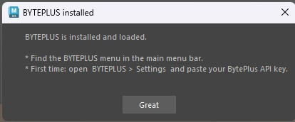
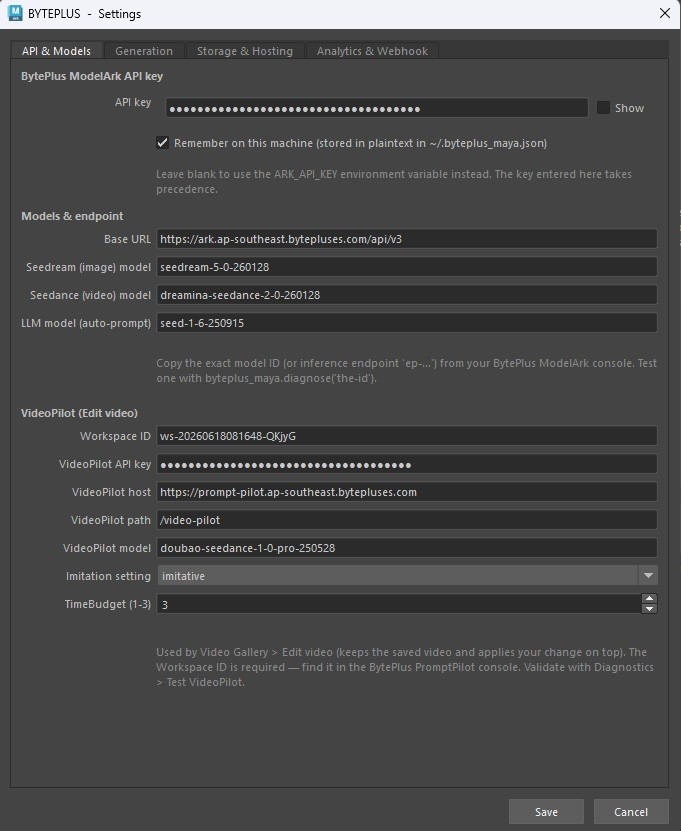
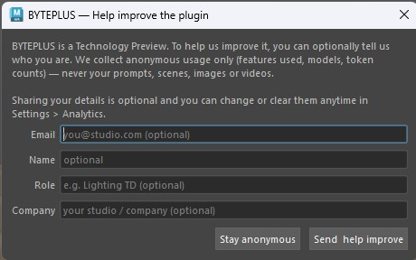
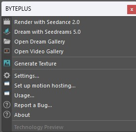
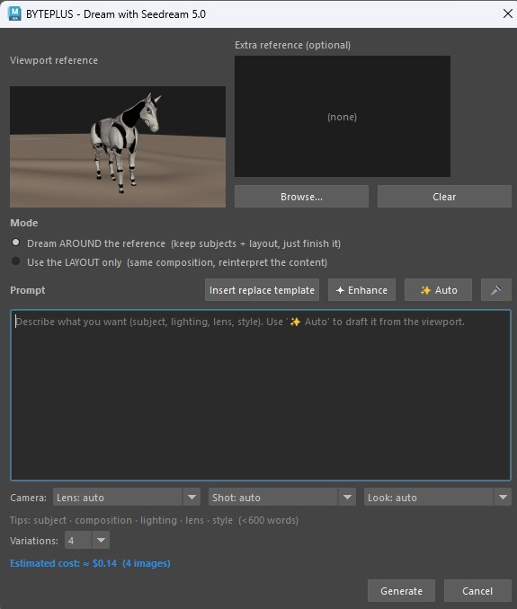
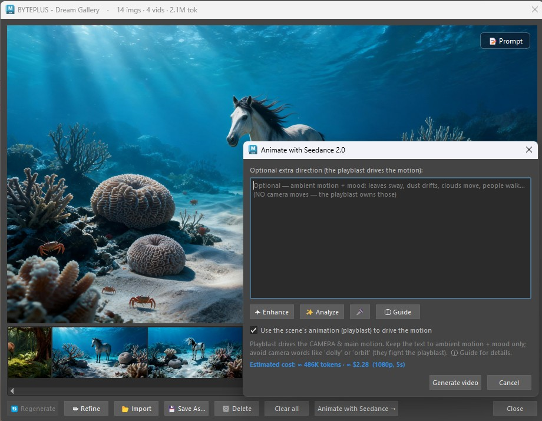
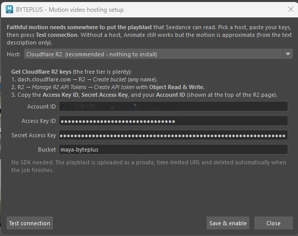
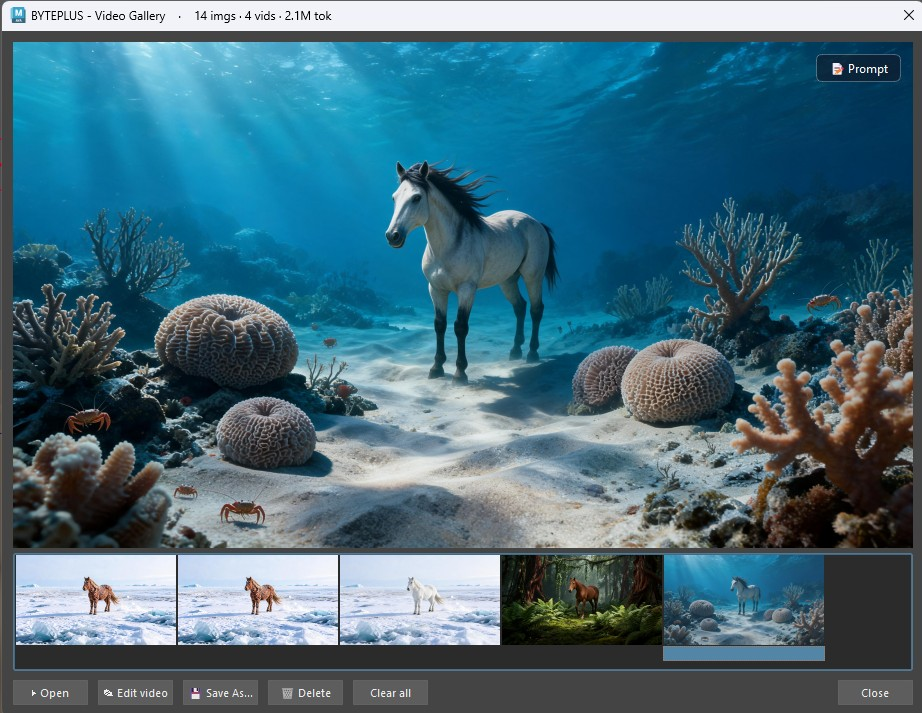
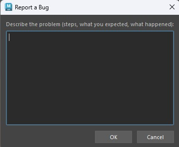
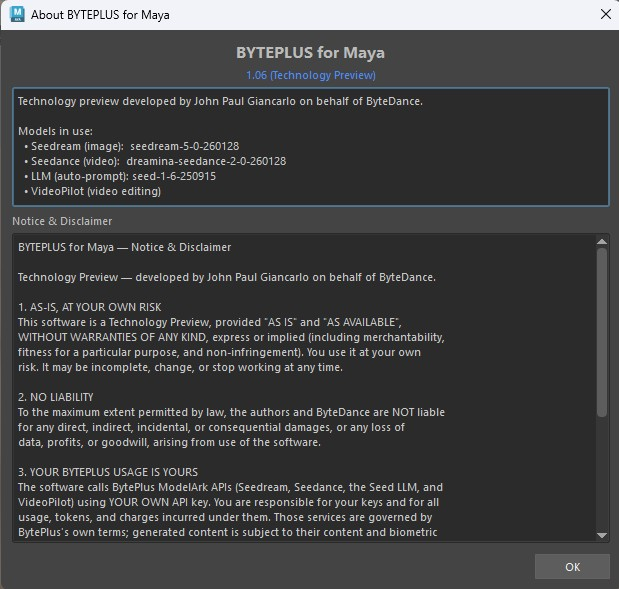

# BYTEPLUS for Maya — User Guide

Bring BytePlus ModelArk generative AI into your Maya workflow: turn your 3D
scenes into rendered video, generate concept images from the viewport, and
create textures wired straight into shaders.

> **Technology Preview** — developed by John Paul Giancarlo on behalf of
> ByteDance. Works in Maya 2025+ on Windows and macOS.

---

## 1. Install

1. Unzip the package.
2. Open Maya.
3. Drag **`install.py`** into the Maya viewport (the 3D area).
4. When it finishes, **restart Maya once** (this applies a crash-prevention
   setting).
5. The **BYTEPLUS** menu appears in the top menu bar and loads automatically on
   every future launch.

> Nothing else to install — **no Python packages, no ffmpeg setup** (ffmpeg is
> bundled for Windows; macOS doesn't need it).

> On the first launch after installing, Maya may show **"Secure UserSetup
> Checksum verification"** (because the installer enabled BYTEPLUS to auto-load).
> Click **Yes** — this is expected and safe.

## 2. First-time setup

Open **BYTEPLUS > Settings…** and, in the **API & Models** tab:

1. Paste your **BytePlus ModelArk API key**.
2. Tick **Remember** if you want it saved between sessions.
3. (Optional) Adjust video resolution, aspect ratio, reference-frame count, etc.

Tip: validate your key any time with **BYTEPLUS > Diagnostics > Test Seedream**.

On first run you'll also see a one-time **"Help improve the plugin"** prompt —
optionally share your details, or click **Stay anonymous**. It won't ask again.

---

## 3. The menu at a glance

| Menu item | What it does |
|---|---|
| **Render with Seedance 2.0** | Renders your animated scene → 1080p AI video |
| **Dream with Seedreams 5.0** | Viewport + prompt → generated concept image |
| **Open Dream Gallery** | Browse / refine / regenerate / animate your images |
| **Open Video Gallery** | Browse / open / edit / save your videos |
| **Generate Texture** | Prompt → texture wired into a new OpenPBR shader |
| **Settings…** | API key, models, resolution, hosting, analytics |
| **Set up motion hosting…** | Guided wizard to enable faithful video motion |
| **Usage…** | Images / videos / tokens used on this machine |
| **Report a Bug…** | Email a report to the developer |
| **About** | Version & credits |
| **Diagnostics** | Connectivity / endpoint test probes |

---

## 4. Features

### 🎬 Render with Seedance 2.0
Turns your **animated 3D scene** into a photoreal AI video.
1. Set up your animation and camera as usual.
2. **BYTEPLUS > Render with Seedance 2.0**.
3. The plugin renders several keyframes with your current renderer (Arnold,
   etc.) for the *look*, captures a playblast for the *motion*, and sends both to
   Seedance. (No prompt to type — it uses the scene's look and motion.)
4. The result opens in the **Video Gallery**.

*Frames scale with clip length: ~3 references for short clips, up to 9 for longer
ones.*

### 🌅 Dream with Seedreams 5.0
Generate a concept image from your viewport + a text prompt.
1. Frame your shot in the viewport.
2. **BYTEPLUS > Dream with Seedreams 5.0**.
3. Choose a mode:
   - **Around reference** — keeps your viewport as a visual base.
   - **Layout only** — uses the viewport just for composition/placement.
4. Type a prompt. Use the helpers:
   - **✦ Enhance** — improves your prompt's wording (text only; keeps your intent).
   - **✨ Auto** — suggests a prompt from the viewport.
   - **Insert replace template** — for natural-language subject replacement.
5. Generate → preview opens with **Save As**. Saved images land in the **Dream
   Gallery**.

### 🖼️ Dream Gallery
Everything you've generated, persistent across sessions. Select an image and:
- **Regenerate** — a fresh variation of the original prompt.
- **Refine** — describe an edit (with its own ✦ Enhance).
- **Animate** — send the image to Seedance to make it move (see below).
- **Import** — bring an external image into the gallery.
- **Save As** / **Delete**.

*Refine — describe an edit to apply to the selected image:*

### ✨ Animate (from the Dream Gallery)
Make a still image move.
1. In the Dream Gallery, select an image → **Animate**.
2. Describe the motion, or use **✨ Re-analyze** for a suggestion.
3. Optionally tick **use playblast** so the motion follows your 3D scene's
   animation while the image defines the look.
4. Generate → the video appears in the Video Gallery.

> The image is the **look reference**; the playblast is the **motion reference**.

### 🔗 Set up motion hosting (for faithful motion)
For Animate / Render to **faithfully follow your scene's motion**, the playblast
must be uploaded somewhere Seedance can read it. A one-time, ~2-minute setup:

1. **BYTEPLUS > Set up motion hosting…**
2. Choose **Cloudflare R2** *(recommended — nothing to install)*. Follow the
   on-screen steps to create a free bucket + API token, then paste your
   **Account ID**, **Access Key ID**, **Secret Access Key** and **Bucket**.
3. Click **Test connection** — it uploads a tiny file, fetches it back and
   deletes it. Wait for the green ✓.
4. Click **Save & enable**.

Without hosting, Animate still works — the motion just comes from your **text
description** (approximate) instead of the playblast.

> Advanced: **BytePlus TOS** is also supported (same vendor as your API key) but
> needs the `tos` Python package; the wizard shows the command. R2 needs nothing.

### 🎞️ Video Gallery
All your videos, persistent. Select one and:
- **▶ Open** — play it in your default player.
- **✎ Edit video** — Seedance 2.0 video-to-video: keeps the source clip
  (subject, motion, camera) and transforms only the change you describe (e.g.
  "set his hair on fire", "make it night"). Press **✦ Enhance** to auto-write the
  full prompt. *Keeps the clip's original audio.*
- **Save As** / **Delete** / **Clear all**.

*Edit video — describe a change; Seedance keeps the source clip and transforms it:*

### 🎨 Generate Texture
1. Select an object (or just run it).
2. **BYTEPLUS > Generate Texture**.
3. Type what you want (e.g. "weathered bronze with green patina"). Set the bump
   depth if needed.
4. The plugin generates the texture and wires it into a **new OpenPBR shader**
   assigned to your object.

---

## 5. Settings reference

Tabs in **Settings…**:

- **API & Models** — API key, base URL, model IDs (Seedream, Seedance, LLM).
- **Generation** — video resolution, aspect ratio, max reference frames,
  reference frame size, bump depth, colour management, SSL verify.
- **Storage & Hosting** — TOS / Cloudflare R2 for hosting videos (used by the
  Render/Animate motion reference and video-to-video editing). Easiest to set up
  via the **Set up motion hosting…** wizard.
- **Analytics & Webhook** — anonymous usage telemetry (PostHog / R2), callback
  URL.

> **Cost guard:** when an estimate exceeds your threshold (*Settings > Generation
> > Confirm above*), BYTEPLUS asks before spending. Cheap jobs (images) never prompt.

---

## 6. Tips & troubleshooting

- **Menu didn't appear?** Restart Maya once; if still missing, re-drag
  `install.py` and check the Script Editor for a `[BYTEPLUS]` error.
- **Maya crashed during generation?** The installer disables Autodesk ADP (a
  known Windows crash) — make sure you **restarted Maya** after installing.
- **"model or endpoint does not exist" / HTTP 404?** Your key is reaching the
  server but that model isn't enabled for your account/region. Re-check the API
  key in Settings and confirm your BytePlus ModelArk account has the models
  enabled; verify with **Diagnostics > Test Seedream**.
- **Animate motion is only "approximate"?** Enable the playblast as a motion
  reference via **BYTEPLUS > Set up motion hosting…** (then tick *use playblast*).
- **SSL certificate error?** In Settings, install `certifi` into Maya's Python or
  untick *Verify SSL certificates* (less secure).
- **A real human face is rejected.** Seedance blocks unverified real faces by
  policy — use non-human / AI-generated subjects.
- **"Edit video" needs motion hosting.** Editing uploads the clip as a public
  URL, so set up Cloudflare R2 / TOS in **Settings > Storage & Hosting**.
- **Something failing?** The **Diagnostics** submenu has a test for each service
  (Seedream, LLM, Seedance, image refs, TOS, R2, telemetry). Results print to the
  Script Editor.
- **Check your usage.** BYTEPLUS > Usage… shows images, videos and tokens used on
  this machine.
- **Found a bug?** BYTEPLUS > Report a Bug…

---

*BYTEPLUS for Maya — Technology Preview. Built on BytePlus ModelArk: Seedream
(image), Seedance (video), and Seed (LLM).*
