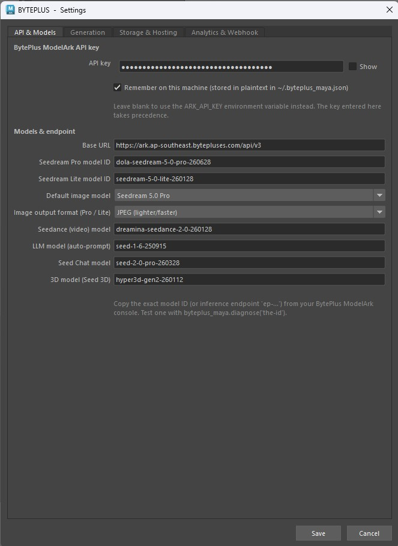
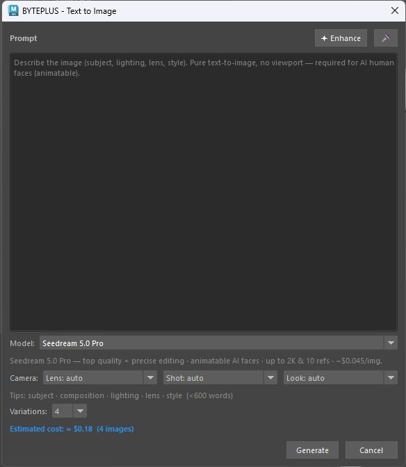
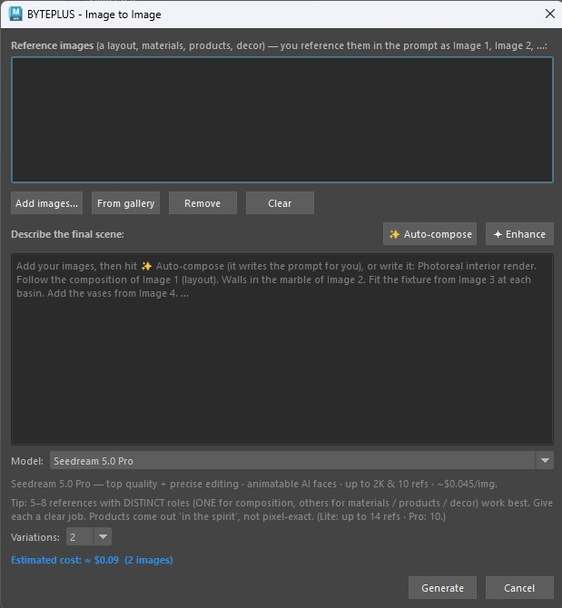
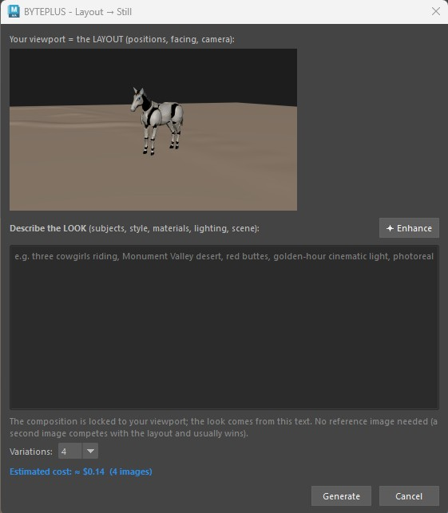
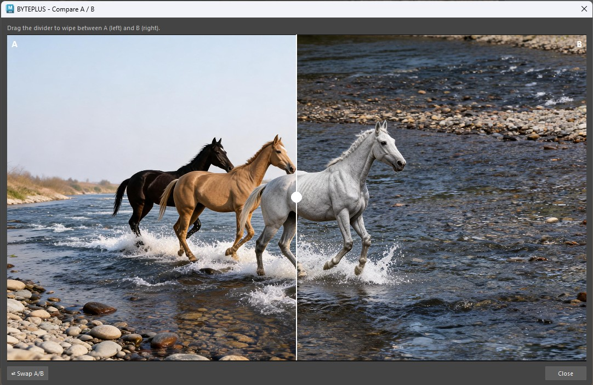
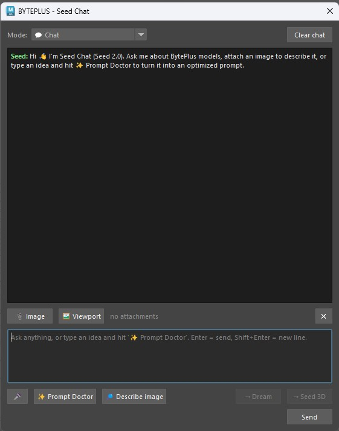
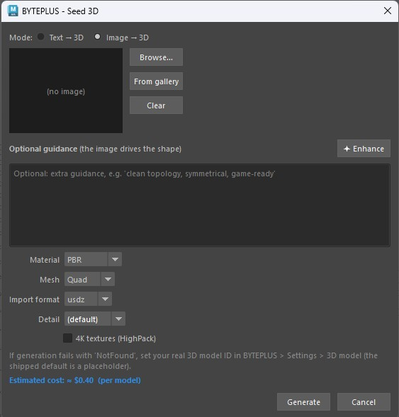
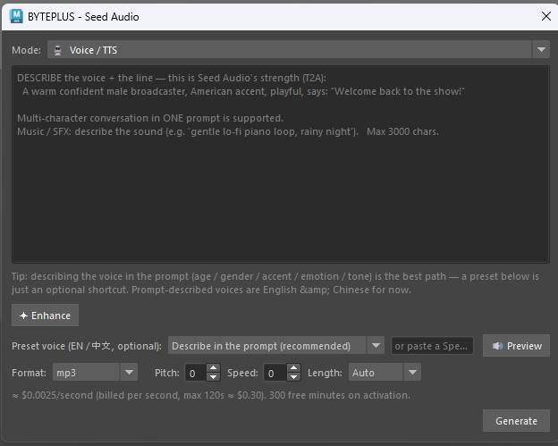
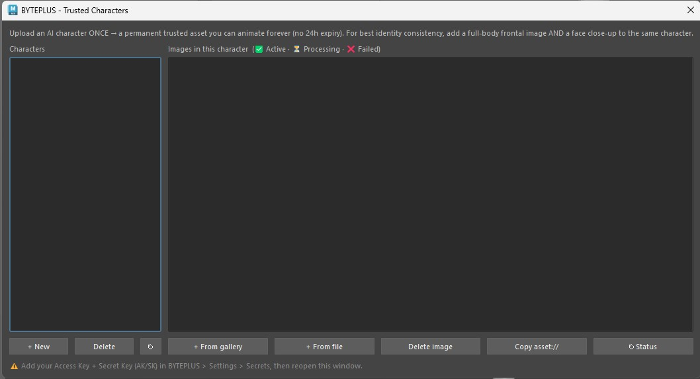

# BYTEPLUS for Maya — User Guide

Bring BytePlus ModelArk generative AI into your Maya workflow: turn your 3D
scenes into rendered video, generate concept images from the viewport or from
reference images, design characters, build quick 3D assets and blockouts, and
chat with an AI that knows the models — and your scene.

> **Technology Preview v1.09** — developed by John Paul Giancarlo on behalf of
> ByteDance. Works in Maya 2025+ on Windows and macOS.

---

## 1. Install

1. Unzip the package.
2. Open Maya.
3. Drag **`install.py`** into the Maya viewport (the 3D area).
4. When it finishes, **restart Maya once** (this applies a crash-prevention
   setting).
5. The **BYTEPLUS** menu appears in the top menu bar and loads automatically on
   every future launch.

> Nothing else to install — **no Python packages, no ffmpeg setup** (ffmpeg is
> bundled for Windows; macOS doesn't need it).

> On the first launch after installing, Maya may show **"Secure UserSetup
> Checksum verification"** (because the installer enabled BYTEPLUS to auto-load).
> Click **Yes** — this is expected and safe.

## 2. First-time setup

Open **BYTEPLUS > Settings…** and, in the **API & Models** tab:

1. Paste your **BytePlus ModelArk API key**.
2. Tick **Remember** if you want it saved between sessions.
3. (Optional) Choose your **Default image model** (Pro / Lite), output format,
   video resolution, aspect ratio, etc.

Tip: validate your key any time with **BYTEPLUS > Diagnostics > Test Seedream**.

On first run you'll also see a one-time **"Help improve the plugin"** prompt —
optionally share your details, or click **Stay anonymous**. It won't ask again.

---

## 3. The menu at a glance

| Menu item | What it does |
|---|---|
| **Render with Seedance 2.0** | Renders your animated scene → 1080p AI video |
| **Video GEN** | Full Seedance 2.0: Text→Video / Image→Video / First+Last frame / Multimodal, + model/resolution/ratio/duration/audio |
| **Dream with Seedreams 5.0** | Viewport + prompt → generated concept image (image-to-image) |
| **Text to Image** | Pure prompt → image, no viewport. Best for **AI people / faces** |
| **Image to Image** | Combine 1–14 reference images (layout + materials + products) → one render |
| **Layout → Still** | Viewport locks the composition; text describes the look → matched still |
| **Open Dream Gallery** | Browse / refine / interactive-edit / compare / animate / blockout your images |
| **Open Video Gallery** | Browse / open / edit / save your videos |
| **Open Audio Gallery** | Browse / play / save your generated audio (voice / music / SFX) |
| **Seed Chat** | Chat with Seed 2.0 — prompt help, describe images, ask Model Genius, how-to |
| **Seed 3D** | Text or image → a 3D asset, imported into your scene |
| **Seed Audio** | Generate voice / music / SFX (Seed Audio 1.0) — TTS, described voices, cloning |
| **Seed Character** | Character generator — character sheets, a game A-pose turnaround, prop/clothing sheets |
| **Trusted Characters** | Upload an AI character once → a **permanent** `asset://` you can animate forever (+ a reusable voice) |
| **Dialogue Scene** | Multi-character spoken dialogue → Seedance video with synced voices (EN/ES/JA/ID/PT) |
| **Blockout from image** | Rough primitive layout from a reference image (a guide for Dream) |
| **Seed Assistant** | Agent that inspects/automates your scene (runs code only after you approve) |
| **Generate Texture** | Prompt → texture wired into a new OpenPBR shader |
| **Settings…** | API key, models, resolution, hosting, analytics |
| **Set up motion hosting…** | Guided wizard to enable faithful video motion |
| **Usage…** | Images / videos / 3D / tokens used on this machine |
| **Report a Bug…** | Email a report to the developer |
| **About** | Version & credits |
| **Diagnostics** | Connectivity / endpoint test probes |

---

## 4. Choosing the image model — Pro vs Lite

Every image window (Text to Image, Image to Image, Dream, Layout → Still, Seed
Character, Refine, Interactive Edit, Generate Texture) has a **Model** dropdown
with a short capability note. Pick per generation:

- **Seedream 5.0 Pro** *(default)* — the **highest quality**, with **precise /
  interactive editing** and **animatable faces** (Seedance-trusted). Up to 10
  reference images, output up to 2048×2048. It runs a higher-quality mode, so it
  is **slower** (a detailed image can take a few minutes) — the plugin waits for
  it automatically.
- **Seedream 5.0 Lite** — **faster and cheaper**, up to **4K** output and **14**
  reference images. Ideal for large **character sheets** and quick iterations.
  Faces are animatable too.

> **Output format** (JPEG / PNG) is set once in **Settings > API & Models** and
> applies to both models. **JPEG** is lighter and faster (recommended); **PNG**
> is lossless but heavy.

> **Set the default** in **Settings > API & Models > Default image model** — each
> window's dropdown starts there, and you can still switch per generation.

---

## 5. Features

### 🎬 Render with Seedance 2.0
Turns your **animated 3D scene** into a photoreal AI video.
1. Set up your animation and camera as usual.
2. **BYTEPLUS > Render with Seedance 2.0**.
3. The plugin renders several keyframes with your current renderer (Arnold,
   etc.) for the *look*, captures a playblast for the *motion*, and sends both to
   Seedance. (No prompt to type — it uses the scene's look and motion.)
4. The result opens in the **Video Gallery**.

*Frames scale with clip length: ~3 references for short clips, up to 9 for longer
ones.*

> **Best practice:** for the motion to be faithfully followed, set up **motion
> hosting** once (see below) so the playblast can be sent as a reference. Keep the
> **playblast length matched to a whole-second output duration** — otherwise
> Seedance time-warps the motion.

### 🎥 Video GEN
The full **Seedance 2.0** generator in one window — every modality and parameter.
1. **BYTEPLUS > Video GEN**.
2. Pick a **Mode**:
   - **Text → Video** — pure prompt.
   - **Image → Video** — animate a start frame (from the gallery or a file).
   - **First + Last frame** — a start **and** an end frame.
   - **Multimodal** — 1–9 reference images (look / identity / props) + up to 3
     reference videos (motion) + up to 3 character voices.
3. Choose the **Model** (Base = 1080p/4k · Fast / Mini = 480/720, cheaper), plus
   **Resolution**, **Aspect ratio**, **Duration** (or *Auto*), **Generate audio**,
   **Watermark** and **Priority**.
4. *(Optional)* tick **🎥 Use the scene's animation (playblast)** so the clip follows
   your Maya camera/motion (Text→Video or Multimodal; needs motion hosting).
5. Write the prompt (✦ Enhance; put spoken lines in "double quotes") and
   **Generate** → the clip lands in the Video Gallery.

> **Best practice:** prototype at 480p/720p (or Fast / Mini), lock the prompt, then
> re-render at 1080p/4k on Base. External human faces are rejected — use trusted
> images (Text to Image / Trusted Characters) for faces.

### 🌅 Dream with Seedreams 5.0
Generate a concept image from your **viewport** + a text prompt (image-to-image).
1. Frame your shot in the viewport.
2. **BYTEPLUS > Dream with Seedreams 5.0**.
3. Choose how to use the viewport:
   - **Dream AROUND the reference** — keeps your subjects + layout and just
     finishes the look.
   - **Use the LAYOUT only** — same composition, but the look comes entirely from
     your prompt text.
4. Pick a **Model** (Pro / Lite), type a prompt, and use the helpers:
   - **✦ Enhance** — improves your prompt's wording (text only; keeps your intent).
   - **✨ Auto** — writes a prompt from scratch by analysing the viewport.
5. Choose **Variations** and Generate → preview opens with **Save As**. Saved
   images land in the **Dream Gallery**.

> **Best practice:** an **Extra reference** injects a *subject* (a clean, isolated
> object/character) into your composition — it is **not** for copying a whole
> scene's look. If you add a busy scene as the extra reference it competes with
> your viewport layout and usually wins.

### 🧑‍🎤 Text to Image
Pure **prompt → image**, with **no viewport** — the dedicated tool for **AI
people, portraits and faces**.
1. **BYTEPLUS > Text to Image**.
2. Pick a **Model** (Pro / Lite — both produce **animatable** faces), type your
   prompt, press **✦ Enhance** to tighten it, choose **Variations**.
3. Generate → results open in the Dream Gallery.

> **Why it matters for video:** a face made here is a **trusted** AI output, so
> you can **Animate** it with Seedance. Viewport-guided or imported faces are
> treated as image-to-image and are rejected unless your account has KYC HIGH. For
> a face you'll reuse across many videos, register it in **Trusted Characters**
> (permanent — see below).

### 🖇️ Image to Image
Combine **multiple reference images** — a layout, materials, products, decor —
into one photoreal render (no viewport involved). Seedream accepts up to **14**
references (Lite) / **10** (Pro).
1. **BYTEPLUS > Image to Image**.
2. **Add images…** (or **From gallery**). They are numbered *Image 1, Image 2, …*
   in the order shown.
3. Press **✨ Auto-compose** *(recommended)* — Seed 2.0 looks at each image, gives
   it a role (composition / material / product / decor) and writes the structured
   prompt for you. Review/edit it, or press **✦ Enhance** to tighten it.
4. Pick a **Model** and **Variations**, then Generate. Results open in the Dream
   Gallery.

> **Best practice:** **5–8 references with DISTINCT roles** work best — exactly
> **one** image for the composition/layout, the rest for materials, products and
> decor. Give each a clear job. Products come out **"in the spirit"**, not
> pixel-exact (Seedream treats references as soft guidance, not a stencil). Always
> try **✨ Auto-compose** first — a plain hand-written prompt tends to blend
> everything together.

### 🧭 Layout → Still
When you want your **viewport composition** but a completely different **look**,
this is the dedicated tool (A/B-verified to lock the layout).
1. Frame the shot — positions, facing and camera are what get locked.
2. **BYTEPLUS > Layout → Still**.
3. **Describe the LOOK** (subjects, style, materials, lighting, scene) and press
   **✦ Enhance** if you want the wording tightened.
4. Pick a **Model** and how many **Variations**, then Generate.

> **Best practice:** do **not** add a reference image here. The composition is
> locked to your viewport and the look comes from the *text* — a second image
> competes with the layout and usually wins.

### 🖼️ Dream Gallery
Everything you've generated, persistent across sessions and **sorted by date
(newest on the right)**. Zoom any thumbnail with the **mouse wheel** and pan by
dragging. Select an image and:
- **🔄 Regenerate** — a fresh variation of the original prompt.
- **✏ Refine** — describe an edit (with its own ✦ Enhance).
- **✎ Interactive Edit** — draw edit marks directly on the image (see below).
- **⇄ Compare** — an A/B wipe slider between two images.
- **📂 Import** — bring an external image into the gallery.
- **Animate with Seedance →** — send the image to Seedance to make it move.
- **Save As** / **🗑 Delete** / **Clear all**.
- **Right-click → Blockout from image / Interactive Edit**.

*Refine — describe an edit to apply to the selected image:*

### 🖊️ Interactive Edit
Leverages **Seedream 5.0 Pro's interactive editing** — you **draw** what you want
changed directly on the image instead of describing coordinates in words.
1. In the Dream Gallery, select an image → **✎ Interactive Edit** (button or
   right-click).
2. Mark up the canvas with the tools: **box, arrow, pencil, text label,
   numbered marker**, colour picker, undo/clear. Use **Select** to move or delete
   a mark, and the **mouse wheel** to zoom.
3. Optionally add **reference images** (e.g. the glasses or hat you want inserted)
   — they become *reference image 2, 3, …*.
4. Type the edit prompt (✦ Enhance available, plus templates for layer
   separation / precise coordinates / sketch tags) and Generate. The marks guide
   the edit and are removed from the final image.

*Compare — drag the slider to wipe between two versions:*

### ✨ Animate (from the Dream Gallery)
Make a still image move.
1. In the Dream Gallery, select an image → **Animate with Seedance →**.
2. Describe the motion, or use **✨ Analyze** for a suggestion. You can pick a
   different source frame with the reference picker.
3. **🎭 Trusted character** *(optional)* — use a permanent trusted character
   (`asset://`) as the main image instead of the selected one: no 24-hour expiry
   and no face rejection (see **Trusted Characters**).
4. Optionally tick **use playblast** so the motion follows your 3D scene's
   animation while the image defines the look.
5. Generate → the video appears in the Video Gallery.

> The image is the **look reference**; the playblast is the **motion reference**.

> **Multiple videos at once:** you can queue several Animate jobs in parallel (up
> to your account's Seedance limit — **3** on individual accounts, **10** on
> enterprise-verified ones). Set the cap in **Settings > Generation > Max
> concurrent Seedance jobs**. Submitting past the cap tells you to wait.

*Reference picker — choose which image drives the animation:*

### 🔗 Set up motion hosting (for faithful motion)
For Animate / Render to **faithfully follow your scene's motion**, the playblast
must be uploaded somewhere Seedance can read it. A one-time, ~2-minute setup:

1. **BYTEPLUS > Set up motion hosting…**
2. Choose **Cloudflare R2** *(recommended — nothing to install)*. Follow the
   on-screen steps to create a free bucket + API token, then paste your
   **Account ID**, **Access Key ID**, **Secret Access Key** and **Bucket**.
3. Click **Test connection** — it uploads a tiny file, fetches it back and
   deletes it. Wait for the green ✓.
4. Click **Save & enable**.

Without hosting, Animate still works — the motion just comes from your **text
description** (approximate) instead of the playblast.

> Advanced: **BytePlus TOS** is also supported (same vendor as your API key) but
> needs the `tos` Python package; the wizard shows the command. R2 needs nothing.

### 🎞️ Video Gallery
All your videos, persistent and sorted by date. Each thumbnail is a **real frame**
of the clip (the first non-black frame), so posters are stable — not random.
Select a clip and:
- **▶ Open** — play it in your default player.
- **✎ Edit video** — Seedance 2.0 video-to-video: keeps the source clip
  (subject, motion, camera) and transforms only the change you describe (e.g.
  "set his hair on fire", "make it night"). Press **✦ Enhance** to auto-write the
  full prompt. *Keeps the clip's original audio.*
- **Save As** / **🗑 Delete** / **Clear all**.

*Edit video — describe a change; Seedance keeps the source clip and transforms it:*

### 💬 Seed Chat
A chat window backed by **Seed 2.0** (multimodal). Use it to plan shots, learn
the models, turn a rough idea into a clean prompt — or **ask how to use the
plugin** (it knows the menu and features).
1. **BYTEPLUS > Seed Chat**.
2. Pick a **Mode**: 💬 *Chat*, 🖼 *Image prompt (Seedream)* or 🎬 *Video prompt
   (Seedance)* — the mode tunes the ✨ Prompt Doctor button.
3. Attach references with **📎 Image** or **🖼 Viewport** to have it describe them.
4. Buttons:
   - **✨ Prompt Doctor** — rewrites your text into an optimized **English** prompt.
   - **🔎 Describe image** — describes the attached image and suggests a prompt.
   - **→ Dream** / **→ Seed 3D** — send the last reply straight into that tool.

### 🧊 Seed 3D
Generate a **3D asset** from text or an image and import it into your scene.
1. **BYTEPLUS > Seed 3D**.
2. Choose **Text → 3D** or **Image → 3D** (Browse… or From gallery for the image).
3. Describe the asset (✦ Enhance to tidy the wording).
4. Options: **Material** (PBR / Shaded / None), **Mesh** (Quad / Raw), **Format**
   (usdz / fbx / obj).
5. Generate → the mesh is imported with its textures wired up.

> **Best practice:** for **Image → 3D**, use a single **clean, well-lit subject**
> on a plain background. Choose **PBR + Quad** for a game-ready, textured,
> clean-topology asset. To model a character, feed **one** A-pose view from Seed
> Character's game turnaround — **not** the whole multi-view sheet.

### 🔊 Seed Audio
Generate **voice, music and sound effects** with **Seed Audio 1.0**, then reuse them
in your videos.
1. **BYTEPLUS > Seed Audio** (first paste your **Seed Audio API key** in
   Settings > API & Models — it's a *separate* key from the Voice console).
2. Pick a **mode**: 🎙️ **Voice / TTS**, 🎵 **Music & SFX**, or 👤 **Clone voice**
   (from a reference clip).
3. **Describe the voice in the prompt** — Seed Audio's strength, e.g. *"A warm
   confident male narrator says: 'Welcome to the show.'"* Multi-character scripts in
   one prompt are supported. Or pick a **preset voice** (optional) and **🔊 Preview**.
4. Set format / pitch / speed / length and **Generate** → it plays and lands in the
   **Audio Gallery**.

> **Language:** Seed Audio currently generates **English & Chinese** (more coming).
> Seedance video **dialogue** also speaks **Spanish / Japanese / Indonesian /
> Portuguese** — see **Dialogue Scene** below.

### 🧍 Seed Character
A dedicated **character generator** — people, creatures or robots — plus their
props and clothing, on clean grey studio backgrounds.
1. **BYTEPLUS > Seed Character**.
2. Fill in the character fields, **or** load a **photo** and let the assistant
   **describe it and fill the fields for you**.
3. Choose what to produce:
   - **Character sheet** (2×2 / 2×3 grid of consistent views / expressions).
   - **Game A-pose turnaround** — clean front/side/back A-pose views intended for
     3D modelling (send **one** view to Seed 3D).
   - **Prop / clothing sheet** — ghost-mannequin item sheets (glasses, hats,
     shoes, outfits) on grey.
4. Pick a **Model** (Lite is great for the large sheets; Pro for top fidelity) and
   Generate → results open in the Dream Gallery.

> **Best practice:** generate the **character sheet** first to lock the identity,
> then the **turnaround** and **item sheets** for the same character. For 3D, send
> a **single** A-pose view to Seed 3D (a full sheet would be modelled as a flat
> board).

### 🎭 Trusted Characters
Upload an AI character **once** and get a **permanent** `asset://` reference that
Seedance **trusts forever** — no 24-hour expiry, and it animates without face
rejection, with **consistent identity** across videos. *(Requires **Advanced
Creation Rights** on your BytePlus account.)*

**One-time setup**
1. In your BytePlus console, create an **Access Key + Secret Key (AK/SK)** (IAM >
   Access Keys) — these are different from your Bearer API key.
2. Paste them in **BYTEPLUS > Settings > Storage & Hosting > Trusted Asset
   Library** (or leave blank to reuse your TOS keys — same account).
3. The **first** time you create a character, BytePlus asks you to sign a one-time
   **authorization letter** in the console (Model Playground > My assets > Virtual
   Portrait).

**Using it**
1. **BYTEPLUS > Trusted Characters**.
2. **+ New** — create a character (group). Add images with **+ From gallery** or
   **+ From file** — for best consistency add a **full-body frontal** *and* a
   **face close-up** to the same character.
3. Each image processes to **✅ Active** (watch the status badge). Once active it's
   permanent.
4. In **Animate**, press **🎭 Trusted character** and pick it — it becomes the main
   image, permanently animatable.
5. *(Optional)* give the character a **🎙️ voice** — **Generate voice…** (from its
   image, a description, or a preset). The voice is reused for consistent dialogue.

> Real human faces are never allowed (AI-generated characters only). Uploading a
> local image needs motion hosting (R2/TOS) configured; gallery images with a
> fresh Seedream URL upload without it.

### 🎭 Dialogue Scene
Multi-character **spoken dialogue**, generated by Seedance 2.0 with synced lips.
1. **BYTEPLUS > Dialogue Scene**.
2. Build a **cast** (up to 3): **+ Add character** picks a **Trusted Character**
   (its image + its voice, if it has one).
3. Write the **script**, one line per character:
   `@Ana: ¡Hola Danny! ¿Cómo estás?`  /  `@Danny: Muy bien, ¿y tú?`
4. Optionally add a **Scene** line (setting / mood / camera), pick the duration, and
   **Generate scene** → the clip lands in the Video Gallery.

> **Works in Spanish** (and English / Japanese / Indonesian / Portuguese) — Seedance
> speaks the lines directly. Give each character a voice in **Trusted Characters**
> for a consistent timbre.

### 🧱 Blockout from image
Turn a reference image into a **rough 3D primitive layout** — a controllable guide
you tweak, then feed back to Dream or use to guide animation. Available from the
menu **and** from the Dream Gallery right-click.
1. **BYTEPLUS > Blockout from image** (or right-click an image in the Dream
   Gallery → **Blockout from image**).
2. Seed 2.0 detects the main objects (boxes + depth + a suggested primitive) and
   lists them — **uncheck** anything you don't want.
3. Choose a **Placement**:
   - **Camera-matched (looks like the photo)** — best as a Dream reference /
     animation guide.
   - **Floor layout (3D stage)** — objects stood on a floor + back wall.
4. Optionally tick **Project the photo onto the blocks (2.5D matte)** and press
   **6** for textured view.
5. **Create blockout** — geometry is built in a single undo step.

> **Best practice:** this is a **rough 2.5D guide** (depth is estimated, not
> measured). Adjust the blocks/camera, then **Dream** or **animate through
> `blockout_cam`**.

### 🤖 Seed Assistant
An in-Maya **agent** that can inspect and automate your scene. It proposes Python
and **runs it only after you approve it**.
1. **BYTEPLUS > Seed Assistant**.
2. Tell it what to do — e.g. *"select all lights"*, *"rename selected to
   prop_###"*, *"lay these out on a grid"*.
3. It shows the code it wants to run; review it and **approve** (or decline).

> **Best practice:** always read the proposed code before approving, and **save
> your scene first** for anything that modifies geometry.

### 🎨 Generate Texture
1. Select an object (or just run it).
2. **BYTEPLUS > Generate Texture**.
3. Pick a **Model**, type what you want (e.g. "weathered bronze with green
   patina"), and set the bump depth if needed.
4. The plugin generates the texture and wires it into a **new OpenPBR shader**
   assigned to your object.

---

## 6. Best practices (quick reference)

- **Pick the right image tool.**
  *Viewport look-dev* → **Dream** · *keep my composition, new look* → **Layout →
  Still** · *combine reference images* → **Image to Image** · *AI people/faces* →
  **Text to Image** · *design a character + props* → **Seed Character** · *draw an
  edit on an image* → **Interactive Edit**.
- **Pro or Lite?** **Pro** for top quality, precise editing and the most reliable
  animatable faces; **Lite** for speed, cost and big **4K character sheets**.
- **One job per reference.** In Image to Image, give each image a single distinct
  role and exactly one image the composition. In Dream, an *Extra reference* is a
  subject to inject, not a scene to copy.
- **Let the AI write the prompt.** ✨ Auto-compose (Image to Image), ✨ Auto (Dream)
  and ✨ Prompt Doctor (Seed Chat) beat a quick hand-written prompt — start there.
- **English prompts** land best across Seedream / Seedance; the Enhance / Doctor
  buttons output English for you.
- **Faithful video motion** needs **motion hosting** enabled and a **playblast
  length that matches a whole-second duration**. Describe the **camera move** in
  the prompt when you want a specific one.
- **AI faces in video:** make the face with **Text to Image** (Pro or Lite) and
  animate it, or — for a face you'll reuse — register it in **Trusted Characters**
  for a **permanent** animatable reference. Viewport-guided (image-to-image) faces
  need KYC HIGH; real human faces are never allowed.
- **For 3D characters:** send a **single** A-pose view from Seed Character's game
  turnaround to Seed 3D, not the whole sheet.
- **Save your scene** before running Seed Assistant actions or Generate Texture.
- **Mind the cost guard.** Big jobs prompt before spending; images are cheap and
  never prompt. Check **Usage…** anytime.

---

## 7. Settings reference

Tabs in **Settings…**:

- **API & Models** — API key, base URL, **Seedream Pro / Lite model IDs**,
  **Default image model** (Pro / Lite), **image output format** (JPEG / PNG),
  Seedance / 3D / LLM / Seed Chat model IDs.

  

- **Generation** — video resolution & aspect ratio, **Max concurrent Seedance
  jobs**, max reference frames, **playblast size** (preset dropdown), bump depth,
  colour management, SSL verify.

  

- **Storage & Hosting** — Cloudflare R2 / BytePlus TOS for hosting videos, and the
  **Trusted Asset Library** Access Key / Secret Key. Easiest to set up hosting via
  the **Set up motion hosting…** wizard.

  

- **Analytics & Webhook** — anonymous usage telemetry (PostHog / R2), callback
  URL.

> **Cost guard:** when an estimate exceeds your threshold (*Settings > Generation
> > Confirm above*), BYTEPLUS asks before spending. Cheap jobs (images) never prompt.

---

## 8. Tips & troubleshooting

- **Menu didn't appear?** Restart Maya once; if still missing, re-drag
  `install.py` and check the Script Editor for a `[BYTEPLUS]` error.
- **Maya crashed during generation?** The installer disables Autodesk ADP (a
  known Windows crash) — make sure you **restarted Maya** after installing.
- **"model or endpoint does not exist" / HTTP 404?** Your key is reaching the
  server but that model isn't enabled for your account/region. Re-check the API
  key and model IDs in Settings; verify with **Diagnostics > Test Seedream**.
- **"All variations failed" with Pro?** Pro runs a higher-quality mode and can
  take a few minutes per image — the plugin waits, but a very slow network can
  still time out. Try again, switch that window to **Lite**, or set output format
  to **JPEG** (Settings > API & Models).
- **Animate motion is only "approximate"?** Enable the playblast as a motion
  reference via **BYTEPLUS > Set up motion hosting…** (then tick *use playblast*).
- **Video motion drifts / speeds up?** Match the **playblast length** to a
  whole-second output duration so Seedance doesn't time-warp it.
- **A face is rejected when animating.** Make faces with **Text to Image** and
  animate them, or register the character in **Trusted Characters** (permanent).
  Viewport-guided faces need KYC HIGH; real human faces are never allowed.
- **Trusted Characters: "+ New" does nothing?** Add your **Access Key + Secret
  Key** in **Settings > Storage & Hosting > Trusted Asset Library** first, then
  reopen the window. The very first character also needs the one-time
  authorization letter signed in the console.
- **"Edit video" / uploading a local trusted image needs motion hosting.** Set up
  Cloudflare R2 / TOS in **Settings > Storage & Hosting**.
- **Image to Image mixed everything together?** Use **✨ Auto-compose**, keep to one
  composition image, and give every other image a distinct role.
- **SSL certificate error?** In Settings, install `certifi` into Maya's Python or
  untick *Verify SSL certificates* (less secure).
- **Something failing?** The **Diagnostics** submenu has a test for each service.
  Results print to the Script Editor.
- **Check your usage.** BYTEPLUS > Usage… shows images, videos, 3D and tokens used
  on this machine.
- **Found a bug?** BYTEPLUS > Report a Bug…

---

*BYTEPLUS for Maya — Technology Preview v1.09. Built on BytePlus ModelArk:
Seedream 5.0 (image), Seedance 2.0 (video), Seed 3D, and Seed 2.0 (LLM).*
