# BYTEPLUS for Maya — User Guide

Bring BytePlus ModelArk generative AI into your Maya workflow: turn your 3D
scenes into rendered video, generate concept images from the viewport or from
reference images, design characters and give them voices, build quick 3D assets
and blockouts, and chat with an AI that knows the models — and your scene.

> **Technology Preview v2.02** — developed by John Paul Giancarlo on behalf of
> ByteDance. Works in Maya 2025+ on Windows and macOS.

> New in 2.02? See **WHATS_NEW.md** next to this guide for a short summary.

---

## 1. Install

1. Unzip the package for your platform (`BYTEPLUS_for_Maya_2.02_Windows.zip` or
   `BYTEPLUS_for_Maya_2.02_macOS.zip`).
2. Open Maya.
3. Drag **`install.py`** into the Maya viewport (the 3D area).
4. When it finishes, **restart Maya once** (this applies a crash-prevention
   setting).
5. The **BYTEPLUS** menu appears in the top menu bar and loads automatically on
   every future launch.

> Nothing else to install — **no Python packages**: the BytePlus TOS Python SDK
> and its dependencies are bundled with the plugin (a copy you installed yourself
> with pip takes priority).
>
> **ffmpeg** (used to convert playblasts, join clips and extract frames) ships with
> the plugin on **Windows**. On **macOS** install it once — for example
> `brew install ffmpeg` with Homebrew. The plugin finds it in Homebrew or MacPorts
> even when Maya is opened from the Dock; without it, Extend, joining clips and
> dialogue-track extraction are unavailable on macOS.

> On the first launch after installing, Maya may show **"Secure UserSetup
> Checksum verification"** (because the installer enabled BYTEPLUS to auto-load).
> Click **Yes** — this is expected and safe.

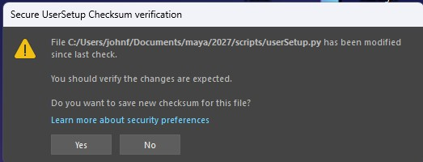

## 2. First-time setup

Open **BYTEPLUS > Settings…** and, in the **API & Models** tab:

1. Paste your **BytePlus ModelArk API key**.
2. Tick **Remember** if you want it saved between sessions.
3. (Optional) Choose your **Default image model** (Pro / Lite), **Image output
   format (Pro / Lite)** and **Seedance (video) model**. Video resolution and
   aspect ratio are in the **Generation** tab.
4. *(Optional — for Seed Audio and Dialogue Audio)* paste your **Seed Audio API
   key**: a *separate* X-Api-Key from the BytePlus Voice console
   (console.byteplus.com/voice), not your ModelArk API key.

Tip: to test your key, tick **Settings > Analytics & Webhook > Developer mode —
Show the Diagnostics menu (developers / partners)**, then run **BYTEPLUS >
Diagnostics > Test Seedream (image)**. Results print to the Script Editor.

On first run you'll also see a one-time **"Help improve the plugin"** prompt —
optionally share your details, or click **Stay anonymous**. It won't ask again.

---

## 3. The menu at a glance

| Menu item | What it does |
|---|---|
| **Render with Seedance 2.0** | Renders your animated scene → AI video with the Seedance model chosen in Settings (up to 4K on 2.0; 720p on 2.5) |
| **Video GEN** | Full Seedance generator: Text→Video / Image→Video / First+Last frame / Multimodal (refs), + model/resolution/ratio/duration/audio |
| **Dream with Seedreams 5.0** | Viewport + prompt → generated concept image (image-to-image) |
| **Text to Image** | Pure prompt → image, no viewport. Best for **AI people / faces** |
| **Image to Image** | Combine 1–14 reference images (layout + materials + products) → one render |
| **Layout → Still** | Viewport guides the composition; text describes the look → matched still |
| **Open Dream Gallery** | Browse / refine / interactive-edit / compare / animate / blockout your images |
| **Open Video Gallery** | Browse / open / edit / extend / save your videos |
| **Open Audio Gallery** | Browse / play / save your generated audio (voice / music / SFX / dialogue) |
| **Seed Chat** | Chat with Seed 2.0 — prompt help, describe images, how-to |
| **Seed 3D** | Text or image → a 3D asset, imported into your scene |
| **Seed Audio** | Generate voice / music / SFX (Seed Audio 1.0) — TTS, described voices, cloning |
| **Seed Character** | Character generator — character sheets, a game A-pose turnaround, prop/clothing sheets |
| **Trusted Characters** | Upload an AI character once → a **permanent** `asset://` you can animate forever (+ a reusable voice) |
| **Dialogue Audio** | Cast of trusted characters + script → each line spoken in its character's voice (+ a mixed track) → Audio Gallery; then add it in Animate / Video GEN as 🎙️ Dialogue audio |
| **Blockout from image** *(experimental)* | Rough primitive massing from a reference image (a starting point to tweak) |
| **Seed Assistant** | Agent that inspects/automates your scene (runs code only after you approve) |
| **Generate Texture** | Prompt → texture wired into a new OpenPBR shader |
| **Settings…** | API keys, models, resolution, hosting, trusted characters, analytics |
| **Set up motion hosting…** | Guided wizard to enable faithful video motion |
| **Usage…** | Images / videos / 3D / tokens used on this machine |
| **Report a Bug…** | Email a report to the developer |
| **About** | Version & credits |
| **Diagnostics** | Connectivity / endpoint test probes — shown only after ticking *Settings > Analytics & Webhook > Developer mode* |

---

## 4. Choosing the image model — Pro vs Lite

Every image window (Text to Image, Image to Image, Dream, Layout → Still, Seed
Character, Refine, Interactive Edit, Generate Texture) has a **Model** dropdown
with a short capability note. Pick per generation:

- **Seedream 5.0 Pro** *(default)* — the **highest quality**, with **precise /
  interactive editing** and **animatable faces** (Seedance-trusted). Up to 10
  reference images, output up to 2048×2048. It runs a higher-quality mode, so it
  is **slower** (a detailed image can take a few minutes) — the plugin waits for
  it automatically.
- **Seedream 5.0 Lite** — **faster and cheaper**, up to **4K** output and **14**
  reference images. Ideal for large **character sheets** and quick iterations.
  Faces are animatable too.

> **Output format** (JPEG / PNG) is set once in **Settings > API & Models > Image
> output format (Pro / Lite)** and applies to both models. **JPEG** is lighter and
> faster (recommended); **PNG** is lossless but heavy.

> **Set the default** in **Settings > API & Models > Default image model** — each
> window's dropdown starts there, and you can still switch per generation.

---

## 5. Features

### 🎬 Render with Seedance 2.0
Turns your **animated 3D scene** into a photoreal AI video.
1. Set up your animation and camera as usual.
2. **BYTEPLUS > Render with Seedance 2.0**.
3. The plugin renders several keyframes with your current renderer (Arnold,
   etc.) for the *look*, captures a playblast for the *motion*, and sends both to
   Seedance. (No prompt to type — it uses the scene's look and motion.)
4. The result opens in the **Video Gallery**.

*Frames scale with clip length: ~3 references for short clips, up to 9 for longer
ones.* The video model is the one selected in **Settings > API & Models >
Seedance (video) model** — on Seedance 2.5, 1080p/4K requests are rendered at
720p.

> **Best practice:** for the motion to be faithfully followed, set up **motion
> hosting** once (see below) so the playblast can be sent as a reference. Keep the
> **playblast length matched to a whole-second output duration** — otherwise
> Seedance time-warps the motion.

### 🎥 Video GEN
The full **Seedance** generator in one window — every modality and parameter.
1. **BYTEPLUS > Video GEN**.
2. Pick a **Mode**:
   - **Text → Video** — pure prompt.
   - **Image → Video** — animate a start frame (from the gallery or a file).
   - **First + Last frame** — a start **and** an end frame.
   - **Multimodal (refs)** — reference images (≤ 9 — identity / look / props) +
     reference videos (≤ 3, ≤ 15 s total — motion / camera) + character voices /
     **🎙️ Dialogue audio** (2.0: ≤ 3 clips / 15 s; 2.5: ≤ 10 clips / 30 s; needs
     *Generate audio*).
3. Choose the **Model**: **2.5 — up to 30 s, 480/720** · **Base — 1080p/4k**
   (Seedance 2.0) · **Fast — 480/720** · **Mini — 480/720** (cheaper). The
   **Resolution** and **Duration** lists follow the model (2.5: 4–30 s; 2.0 tiers:
   4–15 s; or *Auto*). Then set **Ratio**, **Generate audio**, **Watermark** and
   **Priority (0–9)** (2.0 only).
4. *(Optional)* tick **🎥 Use the scene's animation (playblast)** so the clip follows
   your Maya camera/motion (needs motion hosting). If a playblast already exists for
   this scene/range/camera, **♻️ Reuse the last playblast** appears — see *Animate*.
5. Write the prompt (✦ Enhance; put spoken lines in "double quotes") and
   **Generate** → the clip lands in the Video Gallery.

> **🎙️ Dialogue audio (Multimodal):** attach clips made in **BYTEPLUS > Dialogue
> Audio**. Seedance speaks them with synced lips (Audio 1, 2, …), and the speaker
> mapping is added to the prompt for you. Clips are uploaded like the playblast, so
> motion hosting is required. See **Dialogue Audio** below.

> **Why the playblast greys out on First + Last frame:** Seedance's three input
> modes are **mutually exclusive** — a start+end pair can't be combined with a
> reference video. It's a platform rule, not a plugin limit, so the option disables
> itself instead of failing later. Use **Text → Video**, **Image → Video** or
> **Multimodal** to drive motion from your playblast.

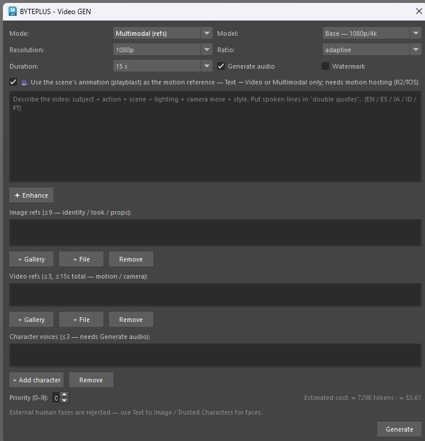

> **Best practice:** prototype at 480p/720p (or Fast / Mini), lock the prompt, then
> re-render at 1080p/4k on **Base** (Seedance 2.0). Need a clip longer than 15 s?
> Use **2.5** (up to 30 s at 480p/720p). External human faces are rejected — use
> trusted images (Text to Image / Trusted Characters) for faces.

### 🌅 Dream with Seedreams 5.0
Generate a concept image from your **viewport** + a text prompt (image-to-image).
1. Frame your shot in the viewport.
2. **BYTEPLUS > Dream with Seedreams 5.0**.
3. Choose how to use the viewport:
   - **Dream AROUND the reference** — keeps your subjects + layout and just
     finishes the look.
   - **Use the LAYOUT only** — same composition, but the look comes entirely from
     your prompt text.
4. Pick a **Model** (Pro / Lite), type a prompt, and use the helpers:
   - **✦ Enhance** — improves your prompt's wording (text only; keeps your intent).
   - **✨ Auto** — writes a prompt from scratch by analysing the viewport.
5. Choose **Variations** and Generate → preview opens with **Save As**. Saved
   images land in the **Dream Gallery**.

> **Best practice:** an **Extra reference** injects a *subject* (a clean, isolated
> object/character) into your composition — it is **not** for copying a whole
> scene's look. If you add a busy scene as the extra reference it competes with
> your viewport layout and usually wins.

### 🧑‍🎤 Text to Image
Pure **prompt → image**, with **no viewport** — the dedicated tool for **AI
people, portraits and faces**.
1. **BYTEPLUS > Text to Image**.
2. Pick a **Model** (Pro / Lite — both produce **animatable** faces), type your
   prompt, press **✦ Enhance** to tighten it, choose **Variations**.
3. Generate → results open in the Dream Gallery.

> **Why it matters for video:** a face made here is a **trusted** AI output, so
> you can **Animate** it with Seedance. Viewport-guided or imported faces are
> treated as image-to-image and are rejected unless your account has KYC HIGH. For
> a face you'll reuse across many videos, register it in **Trusted Characters**
> (permanent — see below).

### 🖇️ Image to Image
Combine **multiple reference images** — a layout, materials, products, decor —
into one photoreal render (no viewport involved). Seedream accepts up to **14**
references (Lite) / **10** (Pro).
1. **BYTEPLUS > Image to Image**.
2. **Add images…** (or **From gallery**). They are numbered *Image 1, Image 2, …*
   in the order shown.
3. Press **✨ Auto-compose** *(recommended)* — Seed 2.0 looks at each image, gives
   it a role (composition / material / product / decor) and writes the structured
   prompt for you. Review/edit it, or press **✦ Enhance** to tighten it.
4. Pick a **Model** and **Variations**, then Generate. Results open in the Dream
   Gallery.

> **Best practice:** **5–8 references with DISTINCT roles** work best — exactly
> **one** image for the composition/layout, the rest for materials, products and
> decor. Give each a clear job. Products come out **"in the spirit"**, not
> pixel-exact (Seedream treats references as soft guidance, not a stencil). Always
> try **✨ Auto-compose** first — a plain hand-written prompt tends to blend
> everything together.

### 🧭 Layout → Still
When you want your **viewport composition** but a completely different **look**,
this is the dedicated tool.
1. Frame the shot — positions, facing and camera are what guide the result.
2. **BYTEPLUS > Layout → Still**.
3. **Describe the LOOK** (subjects, style, materials, lighting, scene) and press
   **✦ Enhance** if you want the wording tightened.
4. Pick a **Model** and how many **Variations**, then Generate.

> **What to expect (honest):** the viewport is a **strong guide, not an exact
> constraint**. Seedream has no structural conditioning (no depth/pose input), so
> the composition will drift somewhat — it is not a ControlNet. **For tighter
> adherence, generate once and then run Image to Image on that result:** an image
> carries far more weight than any wording.

> **Best practice:** don't add a reference image *here* — this window doesn't offer
> one on purpose. (In **Dream with Seedream**, which does, a second image competes
> with the layout and usually wins.)

### 🖼️ Dream Gallery
Everything you've generated, persistent across sessions and **sorted by date
(newest on the right)**. Zoom any thumbnail with the **mouse wheel** and pan by
dragging. Select an image and:
- **🔄 Regenerate** — a fresh variation of the original prompt.
- **✏ Refine** — describe an edit (with its own ✦ Enhance).
- **✎ Interactive Edit** — draw edit marks directly on the image (see below).
- **⇄ Compare** — an A/B wipe slider between two images.
- **📂 Import** — bring an external image into the gallery.
- **🎭 Make permanent** — register the image as a permanent trusted character
  (see **Trusted Characters**).
- **Animate with Seedance →** — send the image to Seedance to make it move.
- **Save As** / **🗑 Delete** / **Clear all**.
- **Right-click → Blockout from image / Interactive Edit**.

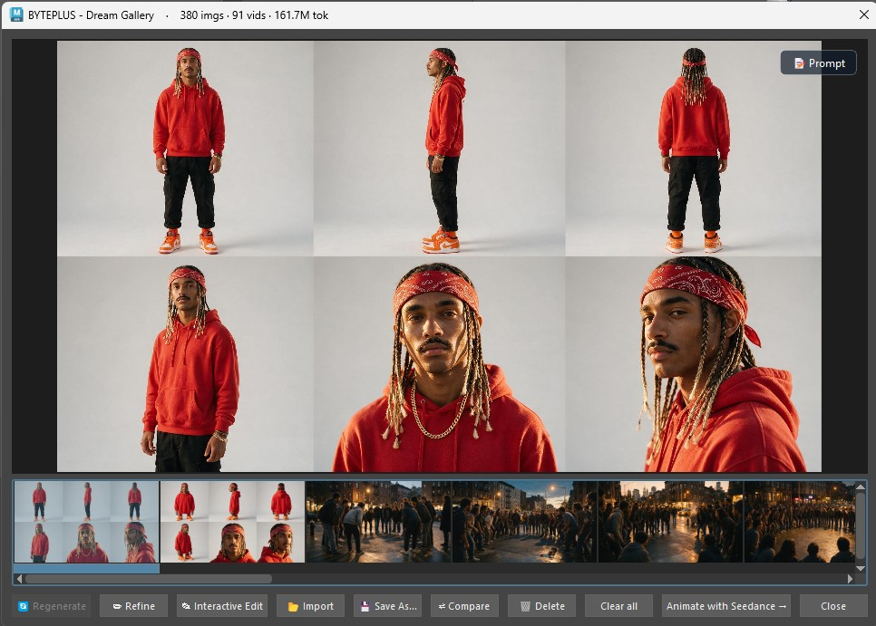

*Refine — describe an edit to apply to the selected image:*

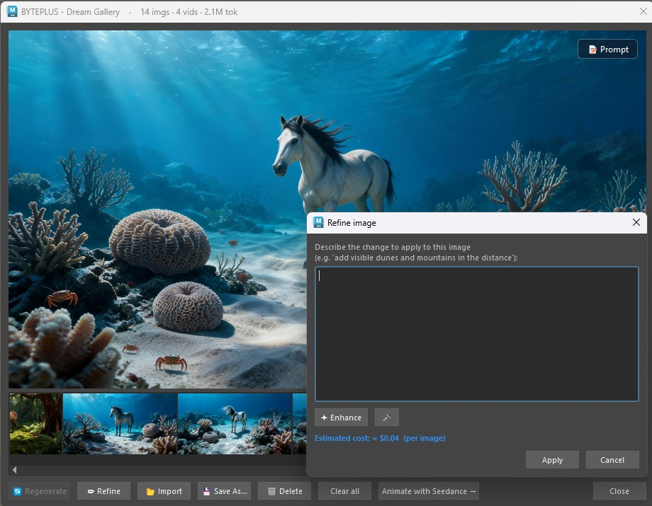

### 🖊️ Interactive Edit
Leverages **Seedream 5.0 Pro's interactive editing** — you **draw** what you want
changed directly on the image instead of describing coordinates in words.
1. In the Dream Gallery, select an image → **✎ Interactive Edit** (button or
   right-click).
2. Mark up the canvas with the tools: **box, arrow, pencil, text label,
   numbered marker**, colour picker, undo/clear. Use **Select** to move or delete
   a mark, and the **mouse wheel** to zoom.
3. Optionally add **reference images** (e.g. the glasses or hat you want inserted)
   — they become *reference image 2, 3, …*.
4. Type the edit prompt (✦ Enhance available, plus templates for layer
   separation / precise coordinates / sketch tags) and Generate. The marks guide
   the edit and are removed from the final image.

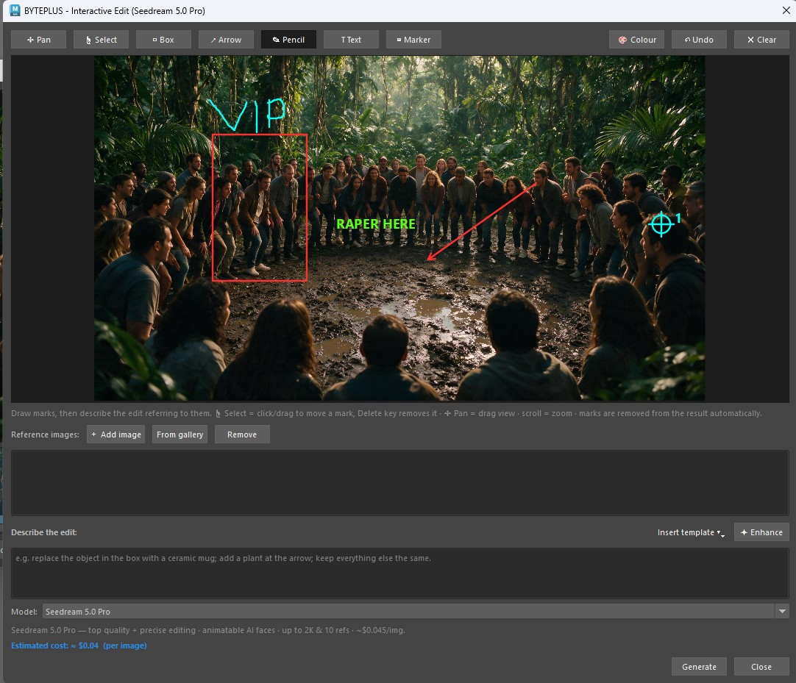

*Compare — drag the slider to wipe between two versions:*

### ✨ Animate (from the Dream Gallery)
Make a still image move.
1. In the Dream Gallery, select an image → **Animate with Seedance →**.
2. Describe the motion, or use **✨ Analyze** for a suggestion (**✦ Compose**
   writes a prompt that uses your extra references). You can pick a different
   source frame with the reference picker.
3. **🎭 Trusted character** *(optional)* — use a permanent trusted character
   (`asset://`) as the main image instead of the selected one: no 24-hour expiry
   and no face rejection (see **Trusted Characters**). **✨ Analyze** and
   **✦ Compose** then describe that character, not the original image.
4. **🎙️ Dialogue audio** *(optional)* — attach dialogue clips made in **BYTEPLUS >
   Dialogue Audio** as reference audio (Audio 1, 2, …). Seedance speaks them with
   synced lips; the speaker mapping is added to the prompt and *Generate audio* is
   forced on. Needs motion hosting — without it the clips are dropped.
5. Optionally tick **Use the scene's animation (playblast) to drive the motion**
   so the motion follows your 3D scene's animation while the image defines the
   look.
6. Pick the **Resolution** for this clip. The list follows the Seedance model in
   Settings: 480p / 720p / 1080p / 4k on Seedance 2.0, 480p / 720p on 2.5. It
   overrides the Settings default for this generation only, and the **estimated
   cost updates live** — prototype at 480p, commit at your final resolution.
7. **♻️ Reuse the last playblast** *(appears only when there's one to reuse)* —
   skips re-capturing the viewport when nothing has changed. See below.
8. Generate → the video appears in the Video Gallery.

> The image is the **look reference**; the playblast is the **motion reference**.

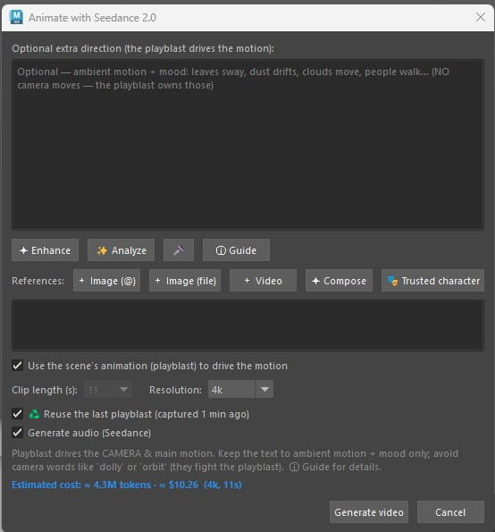

> **♻️ Reusing a playblast.** Capturing the viewport takes real time, and doing it
> again for an unchanged scene is pure waiting. When a playblast already exists for
> **this same scene, frame range and camera**, the checkbox appears and says how old
> it is — *"captured 2 min ago"*. It survives reloading the plugin and restarting
> Maya (each capture is stamped with what it holds), and it's never offered across
> scenes, ranges or cameras.
>
> It's **ticked automatically only when the capture is recent (under 30 minutes)**;
> an older one is offered **unticked**. Maya can't reliably tell us whether you
> changed the animation, so **you** decide: untick it if you have.

> **Multiple videos at once:** you can queue several Animate jobs in parallel (up
> to your account's Seedance limit — **3** on individual accounts, **10** on
> enterprise-verified ones). Set the cap in **Settings > Generation > Max
> concurrent Seedance jobs**. Submitting past the cap tells you to wait.

*Reference picker — choose which image drives the animation:*

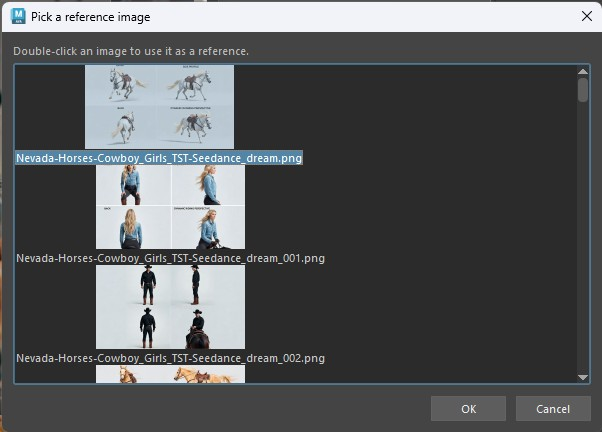

### 🔗 Set up motion hosting (for faithful motion)
For Animate / Render to **faithfully follow your scene's motion**, the playblast
must be uploaded somewhere Seedance can read it. The same hosting is used for
reference videos, **Edit video** / **Extend**, local trusted-character images and
**dialogue audio clips**. A one-time, ~2-minute setup:

1. **BYTEPLUS > Set up motion hosting…**
2. Choose **Cloudflare R2** *(recommended)*. Follow the on-screen steps to create a
   free bucket + API token, then paste your **Account ID**, **Access Key ID**,
   **Secret Access Key** and **Bucket**.
3. Click **Test connection** — it uploads a tiny file, fetches it back and
   deletes it. Wait for the green ✓.
4. Click **Save & enable**.

Without hosting, Animate still works — the motion just comes from your **text
description** (approximate) instead of the playblast, and dialogue audio clips
can't be sent.

> Advanced: **BytePlus TOS** is also supported (same vendor as your API key). Its
> Python SDK is bundled with the plugin — nothing to install. You need a
> **bucket** you create in the BytePlus console and an IAM **Access Key / Secret
> Key**. If your keys are *temporary* STS credentials (`AKTP…`), paste their
> **Session token** too — they expire after ~12 h, and the plugin tells you when to
> mint a fresh set. When both TOS and R2 are configured the plugin uses TOS and
> **falls back to R2** if a TOS upload fails.

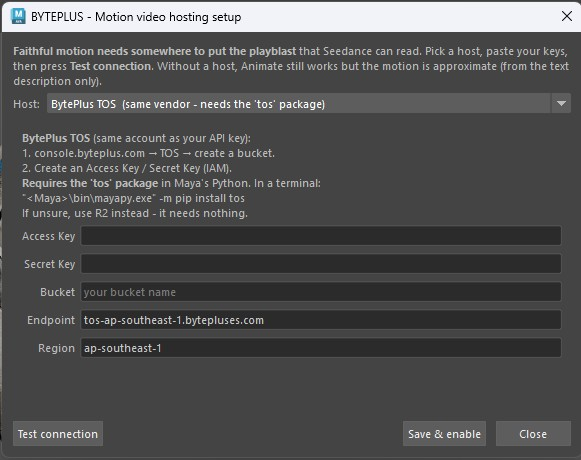

### 🎞️ Video Gallery
All your videos, persistent and sorted by date. Each thumbnail is a **real frame**
of the clip (the first non-black frame), so posters are stable — not random.
A **⏳ Generating…** tile appears in the strip while a new clip renders. Select a clip and:
- **▶ Open** — play it in your default player.
- **✎ Edit video** — Seedance video-to-video: keeps the source clip
  (subject, motion, camera) and transforms only the change you describe (e.g.
  "set his hair on fire", "make it night"). Press **✦ Enhance** to auto-write the
  full prompt. *Keeps the clip's original audio.*
- **⏭ Extend** — continue a clip past the length cap: its trusted last frame becomes
  the first frame of a new one. Add a continuation prompt, a duration, optional
  **🔊 Audio**, and optionally **join A+B** into one video. Chain B→C→… for longer shots.
- **Reference images (Edit video & Extend)** — attach a **+ Gallery** image, a
  **+ File**, or a **🎭 Trusted character** to lock the character's identity and look
  when the face isn't visible in the frame, so Seedance doesn't invent it. *A face
  reference must be trusted — a fresh gallery image, an image you made permanent,
  or a Trusted character — or Seedance rejects it.*
- **Save As** / **🗑 Delete** / **Clear all**.

*Edit video — describe a change; Seedance keeps the source clip and transforms it:*

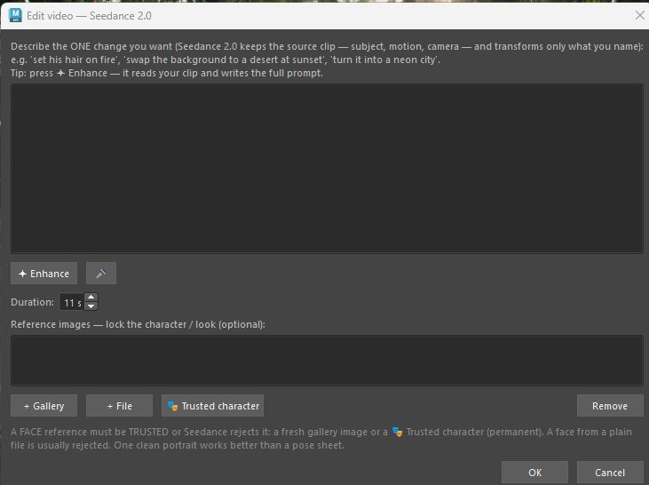

*Extend — continue a clip; add reference images to keep the character consistent:*

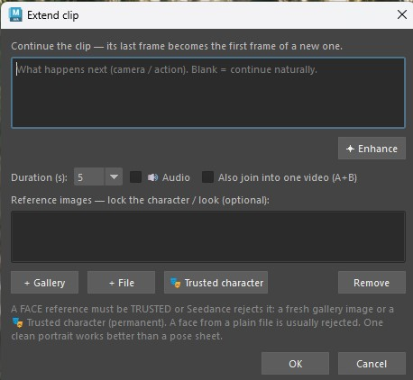

### 💬 Seed Chat
A chat window backed by **Seed 2.0** (multimodal). Use it to plan shots, learn
the models, turn a rough idea into a clean prompt — or **ask how to use the
plugin** (it knows the menu and features).
1. **BYTEPLUS > Seed Chat**.
2. Pick a **Mode**: 💬 *Chat*, 🖼 *Image prompt (Seedream)* or 🎬 *Video prompt
   (Seedance)* — the mode tunes the ✨ Prompt Doctor button.
3. Attach references with **📎 Image** or **🖼 Viewport** to have it describe them.
4. Buttons:
   - **✨ Prompt Doctor** — rewrites your text into an optimized **English** prompt.
   - **🔎 Describe image** — describes the attached image and suggests a prompt.
   - **→ Dream** / **→ Seed 3D** — send the last reply straight into that tool.

### 🧊 Seed 3D
Generate a **3D asset** from text or an image and import it into your scene.
1. **BYTEPLUS > Seed 3D**.
2. Choose **Text → 3D** or **Image → 3D** (Browse… or From gallery for the image).
3. Describe the asset (✦ Enhance to tidy the wording).
4. Options: **Material** (PBR / Shaded / None), **Mesh** (Quad / Raw), **Import
   format** (usdz / fbx / obj), **Detail** ((default) / high / medium / low),
   **4K textures (HighPack)** and **Game-ready: T/A-pose binding (humanoids)**.
5. Generate → the mesh is imported with its textures wired up.

> The Seed 3D model is set in **Settings > API & Models > 3D model (Seed 3D)** —
> default `hyper3d-gen2-260112`. An older saved `Hyper3d-Rodin-Gen2` (which
> returned *404 model not found*) is migrated automatically.

> **Best practice:** for **Image → 3D**, use a single **clean, well-lit subject**
> on a plain background. Choose **PBR + Quad** for a game-ready, textured,
> clean-topology asset. To model a character, feed **one** A-pose view from Seed
> Character's game turnaround — **not** the whole multi-view sheet.

### 🔊 Seed Audio
Generate **voice, music and sound effects** with **Seed Audio 1.0**, then reuse them
in your videos.
1. **BYTEPLUS > Seed Audio** (first paste your **Seed Audio API key** in
   Settings > API & Models — a *separate* X-Api-Key from the BytePlus Voice
   console, console.byteplus.com/voice, not your ModelArk key).
2. Pick a **mode**: 🎙️ **Voice / TTS**, 🎵 **Music & SFX**, or 👤 **Clone voice
   (from a clip)** (a **Reference clip** ≤ 30 s, ≤ 10 MB).
3. **Describe the voice in the prompt** — Seed Audio's strength, e.g. *"A warm
   confident male narrator says: 'Welcome to the show.'"* Multi-character scripts in
   one prompt are supported. Or pick a **Preset voice (EN / 中文, optional)** and
   **🔊 Preview**.
4. Set **Format** (mp3 / wav / ogg_opus), **Pitch**, **Speed** and **Length** (a
   soft hint — Seed Audio has no hard duration control) and press **Generate**.
   The job runs as a row in the activity HUD (cancel with ✕; you can queue several)
   while the window stays usable, and the **Audio Gallery opens by itself** with
   the clip when it is ready.

> Tip: describe the voice *and* the line — age, gender, accent, emotion. Scene
> descriptions such as camera angles or lighting add nothing to audio.

> **Language:** voices described in the prompt are **English & Chinese** for now;
> preset voices are EN / 中文. For multi-character spoken scenes, see **Dialogue
> Audio** below.

### 🎧 Audio Gallery
**BYTEPLUS > Open Audio Gallery** lists this scene's generated audio (voice, music,
SFX and dialogue clips) with durations. Dialogue clips carry a badge —
*🎙️ Name: "line"* for one line, *🎬 dialogue mix (N lines)* for the mixed track.
Buttons: **＋ New** (opens Seed Audio), **▶ Play**, **Save As**, **🗑 Delete**
(removes a dialogue clip's record too). It opens by itself when a Seed Audio or
Dialogue Audio job finishes.

### 🧍 Seed Character
A dedicated **character generator** — people, creatures or robots — plus their
props and clothing, on clean grey studio backgrounds.
1. **BYTEPLUS > Seed Character**.
2. Fill in the character fields, **or** load a **photo** and let the assistant
   **describe it and fill the fields for you**.
3. Choose what to produce:
   - **Character sheet** (2×2 / 2×3 grid of consistent views / expressions).
   - **Game A-pose turnaround (for 3D)** — clean front/side/back A-pose views
     intended for 3D modelling (send **one** view to Seed 3D).
   - **Prop / clothing sheet** — ghost-mannequin item sheets (glasses, hats,
     shoes, outfits) on grey.
4. Pick a **Model** (Lite is great for the large sheets; Pro for top fidelity) and
   Generate → results open in the Dream Gallery.

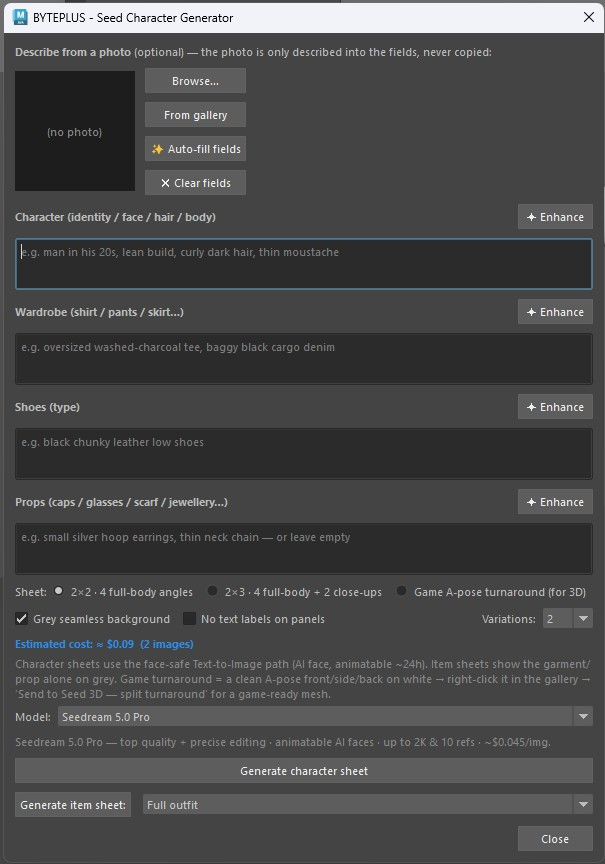

> **Best practice:** generate the **character sheet** first to lock the identity,
> then the **turnaround** and **item sheets** for the same character. For 3D, send
> a **single** A-pose view to Seed 3D (a full sheet would be modelled as a flat
> board).

### 🎭 Trusted Characters
Upload an AI character **once** and get a **permanent** `asset://` reference that
Seedance **trusts forever** — no 24-hour expiry (a plain Dream image is trusted for
~24 h only), and it animates without face rejection, with **consistent identity**
across videos. *(Requires **Advanced Creation Rights** on your BytePlus account.)*

**One-time setup**
1. In your BytePlus console, create an **Access Key + Secret Key (AK/SK)** (IAM >
   Access Keys) — these are different from your Bearer API key.
2. Paste them in **BYTEPLUS > Settings > Storage & Hosting > Trusted Asset
   Library** (or leave them blank to reuse your TOS keys — same account). If they
   are temporary STS keys (`AKTP…`), also paste the **Asset Library Session
   token**; those keys expire after ~12 h.
3. The **first** time you create a character, BytePlus asks you to sign a one-time
   **authorization letter** in the console (Model Playground > My assets > Virtual
   Portrait).

**Using it**
1. **BYTEPLUS > Trusted Characters**.
2. **+ New** — create a character (group). Add images with **+ From gallery** or
   **+ From file** — for best consistency add a **full-body frontal** *and* a
   **face close-up** to the same character.
3. Each image processes to **✅ Active** (watch the status badge, or press
   **↻ Status**). Once active it's permanent.
4. In **Animate**, press **🎭 Trusted character** and pick it — it becomes the main
   image, permanently animatable.
5. *(Optional)* give the character a **🎙️ voice** — **Generate voice…** (from the
   character image, a description, or a preset voice). The voice is reused for
   consistent dialogue (see **Dialogue Audio**).

**Shortcuts and details**
- **Dream Gallery > 🎭 Make permanent** does steps 2–3 for the selected image. It
  asks *Add this image to which character?* (pick one, or **➕ New character…** and
  type a name), shows *⏳ Registering…* on the button, and confirms the result in a
  dialog.
- An image you made permanent is sent as its permanent `asset://` link wherever you
  use it as an extra reference image (Animate, Video GEN, Edit video, Extend).
- The list shows **your** characters (created on this machine). To bring in one
  created elsewhere (console, another machine), press **🔍 Find…**, type part of
  its name (server-side search) and double-click ONE match. Only what you pick is
  loaded, never the whole project.
- **+ From gallery** works even when the Dream Gallery is closed. Only ✅ **Active**
  images can be picked; ⏳ Processing is reported as such. Other buttons: **Delete
  image**, **Copy asset://**, **↻ Status**, **↻** (refresh the list).
- **Images are checked before upload** against the Asset Library limits: JPEG /
  PNG / WEBP / BMP / TIFF / GIF / HEIC / HEIF, each side 300–6000 px, aspect ratio
  0.4–2.5, under 30 MB. An image outside them is refused with the reason, before
  anything is uploaded.
- **Deleting an image or a character** (Delete image / Delete) also invalidates
  every saved permanent link to it, so it is never sent to Seedance again. If a
  character was deleted elsewhere (console, another machine) and Seedance reports
  the asset as not found, the plugin forgets it and tells you so instead of
  retrying — press the button again and the image's fresh link or local file is
  used.
- **Added your keys after opening the window?** Close Trusted Characters and open
  it again from the menu — the list refreshes.
- **Auto-make Extend last frames permanent (asset://)** (Settings > Storage &
  Hosting) registers the last frame used by **Extend** as a permanent asset. It
  runs only once you use the Asset Library — Asset Library keys set, or TOS keys
  reused after you have created a Trusted Character — so a TOS setup made only for
  playblast hosting never registers assets. It never registers the same last frame
  twice. The **🎭 Make permanent** button always works regardless.
- **Diagnostics > Test Trusted Asset Library** (Developer mode) checks your keys
  and IAM policy with a read-only call.

> Real human faces are never allowed (AI-generated characters only). Uploading a
> local image needs motion hosting (R2/TOS) configured; gallery images with a
> fresh Seedream URL upload without it.

> **Known limitation (2.02):** trusted characters are created in your account's
> **default** ModelArk project, and the project is not configurable yet. Use an API
> key and model endpoints that belong to the default project — an asset in another
> project is invisible to Seedance.

### 🗣️ Dialogue Audio → Animate / Video GEN (spoken scenes)
Dialogue is made as **audio first** (cheap to iterate), then attached to the video
as reference audio.
1. Give each character a voice: **Trusted Characters** → select it → **Generate
   voice…** (from its image, a description, or a preset).
2. **BYTEPLUS > Dialogue Audio** → **+ Add character** for each speaker (you pick
   from your Trusted Characters; 🎙️ = has a voice — needed to speak).
3. Write the **Script**, one line each: `@Alice: No, I won't. I am a princess.` —
   use **Insert @tag** to avoid typos. Optional: **Scene** (kept with the clips for
   the video prompt later), **Gap between lines (s)** (default 0.4) and **Also make
   one mixed scene track** (on by default).
4. **🎙️ Generate dialogue audio**. It runs in the activity HUD (cancel with ✕;
   lines already made are kept). You get one clip per line plus the mixed track in
   the **Audio Gallery**, which opens by itself. The status line says whether the
   script fits Seedance 2.0 (≤ 15 s of audio) or 2.5 (≤ 30 s).
5. Make the video in **Animate** (from a Dream image) or **Video GEN › Multimodal
   (refs)** → **🎙️ Dialogue audio** → tick the whole dialogue or individual lines →
   add your playblast, environment and character references → Generate. The plugin
   writes the speaker mapping into the prompt ("Image 1 is Alice; Audio 1 is
   Alice's line …") and Seedance speaks the clip with synced lips.

> **Limits per video:** Seedance 2.0 — 3 clips / 15 s of audio; Seedance 2.5 — 10
> clips / 30 s (a mixed track counts once). Dialogue clips are local files uploaded
> like the playblast, so **motion hosting** (R2 / TOS) is required.

> Tip: iterate on the words and voices here (cents per take) before paying for the
> video. If Seedance's *output* filter flags a finished clip for "copyright", your
> inputs were accepted — retry, rephrase the line, or rename characters that sound
> like protected titles.

### 🧱 Blockout from image *(experimental)*
Turn a reference image into a **rough 3D primitive massing** — a starting point you
tweak, then feed back to Dream or use to guide animation. Available from the menu
**and** from the Dream Gallery right-click.

> **What to expect (honest):** depth is a **coarse 3-tier estimate, not a
> measurement**, so this approximates *composition* — it is **not a
> reconstruction**. It reads busy, object-rich scenes best; wide landscapes and
> abstract sets give poor results. Treat it as a sketch to push around.
1. **BYTEPLUS > Blockout from image** (or right-click an image in the Dream
   Gallery → **Blockout from image**).
2. Seed 2.0 detects the main objects (boxes + depth + a suggested primitive) and
   lists them — **uncheck** anything you don't want.
3. Choose a **Placement**:
   - **Camera-matched (looks like the photo)** — best as a Dream reference /
     animation guide.
   - **Floor layout (3D stage)** — objects stood on a floor + back wall.
4. Optionally tick **Project the photo onto the blocks (2.5D matte)** and press
   **6** for textured view.
5. **Create blockout** — geometry is built in a single undo step.

> **Best practice:** this is a **rough 2.5D guide** (depth is estimated, not
> measured). Adjust the blocks/camera, then **Dream** or **animate through
> `blockout_cam`**.

### 🤖 Seed Assistant
An in-Maya **agent** that can inspect and automate your scene. It proposes Python
and **runs it only after you approve it**.
1. **BYTEPLUS > Seed Assistant**.
2. Tell it what to do — e.g. *"select all lights"*, *"rename selected to
   prop_###"*, *"lay these out on a grid"*.
3. It shows the code it wants to run; review it and **approve** (or decline).

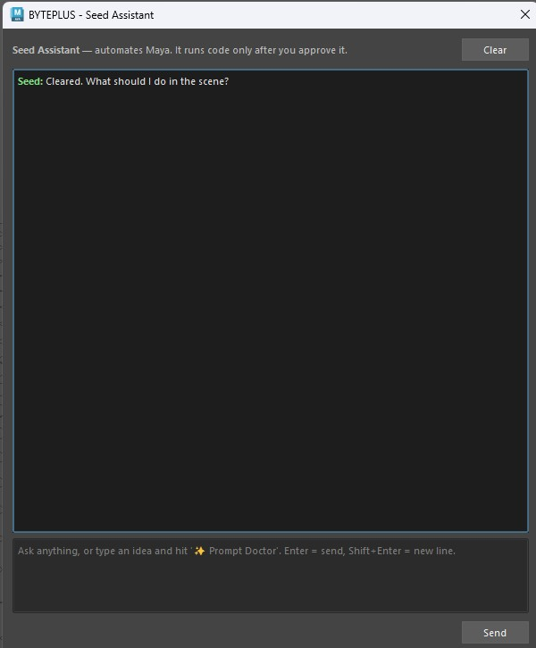

> **Best practice:** always read the proposed code before approving, and **save
> your scene first** for anything that modifies geometry.

### 🎨 Generate Texture
1. Select an object (or just run it).
2. **BYTEPLUS > Generate Texture**.
3. Pick a **Model**, type what you want (e.g. "weathered bronze with green
   patina"), and set the bump depth if needed.
4. The plugin generates the texture and wires it into a **new OpenPBR shader**
   assigned to your object.

---

## 6. Best practices (quick reference)

- **Pick the right image tool.**
  *Viewport look-dev* → **Dream** · *keep my composition, new look* → **Layout →
  Still** · *combine reference images* → **Image to Image** · *AI people/faces* →
  **Text to Image** · *design a character + props* → **Seed Character** · *draw an
  edit on an image* → **Interactive Edit**.
- **Pro or Lite?** **Pro** for top quality, precise editing and the most reliable
  animatable faces; **Lite** for speed, cost and big **4K character sheets**.
- **One job per reference.** In Image to Image, give each image a single distinct
  role and exactly one image the composition. In Dream, an *Extra reference* is a
  subject to inject, not a scene to copy.
- **Let the AI write the prompt.** ✨ Auto-compose (Image to Image), ✨ Auto (Dream)
  and ✨ Prompt Doctor (Seed Chat) beat a quick hand-written prompt — start there.
- **English prompts** land best across Seedream / Seedance; the Enhance / Doctor
  buttons output English for you.
- **Faithful video motion** needs **motion hosting** enabled and a **playblast
  length that matches a whole-second duration**. Describe the **camera move** in
  the prompt when you want a specific one.
- **AI faces in video:** make the face with **Text to Image** (Pro or Lite) and
  animate it, or — for a face you'll reuse — register it in **Trusted Characters**
  for a **permanent** animatable reference. Viewport-guided (image-to-image) faces
  need KYC HIGH; real human faces are never allowed.
- **2.0 or 2.5?** 2.5 gives up to 30 s clips at 480p/720p; stay on 2.0 (Base) for
  1080p/4K.
- **Dialogue: audio first.** Make the lines in **Dialogue Audio** (cheap), check
  them in the Audio Gallery, then attach them in Animate / Video GEN with
  **🎙️ Dialogue audio**.
- **For 3D characters:** send a **single** A-pose view from Seed Character's game
  turnaround to Seed 3D, not the whole sheet.
- **Save your scene** before running Seed Assistant actions or Generate Texture.
- **Mind the cost guard.** Big jobs prompt before spending; images are cheap and
  never prompt. Check **Usage…** anytime.

---

## 7. Settings reference

Tabs in **Settings…**:

- **API & Models** — API key, base URL, **Seedream Pro / Lite model IDs**,
  **Default image model** (Pro / Lite), **Image output format (Pro / Lite)**
  (JPEG / PNG), **Seedance (video) model** (Seedance 2.5 — 30 s, 480/720 ·
  Seedance 2.0 — 15 s, up to 4K · Seedance 2.0 fast · Seedance 2.0 mini),
  **LLM model (auto-prompt)**, **Seed Chat model**, **3D model (Seed 3D)**, and the
  **Seed Audio API key** (separate X-Api-Key from the Voice console).

  

- **Generation** — **Video resolution**, **Max concurrent Seedance jobs**, **Video
  aspect ratio**, **Image aspect ratio**, **Max reference frames**, **Playblast
  size** (preset dropdown), **Texture bump depth**, colour management (OCIO view
  transform on rendered refs), and the **Cost estimate** (show cost, **Confirm
  above**).

  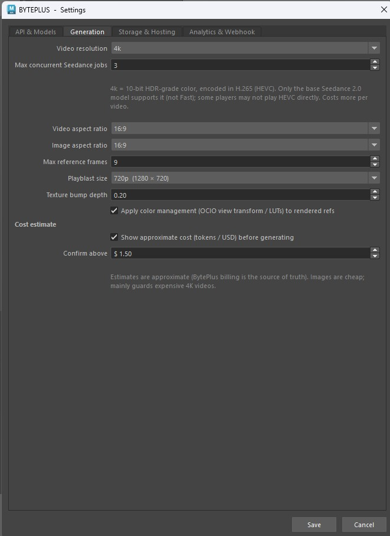

- **Storage & Hosting** — **Verify SSL certificates**; BytePlus TOS / Cloudflare
  R2 for hosting the playblast, reference videos, edited clips and dialogue audio;
  and the **Trusted Asset Library** Access Key / Secret Key plus **Auto-make Extend
  last frames permanent (asset://)**. **Session token** fields (*TOS Session token*, *Asset Library
  Session token*) are ONLY for temporary STS keys (`AKTP…`); leave them blank for
  permanent IAM keys. Asset Library keys left blank reuse the TOS keys. Easiest to
  set up hosting via the **Set up motion hosting…** wizard.

  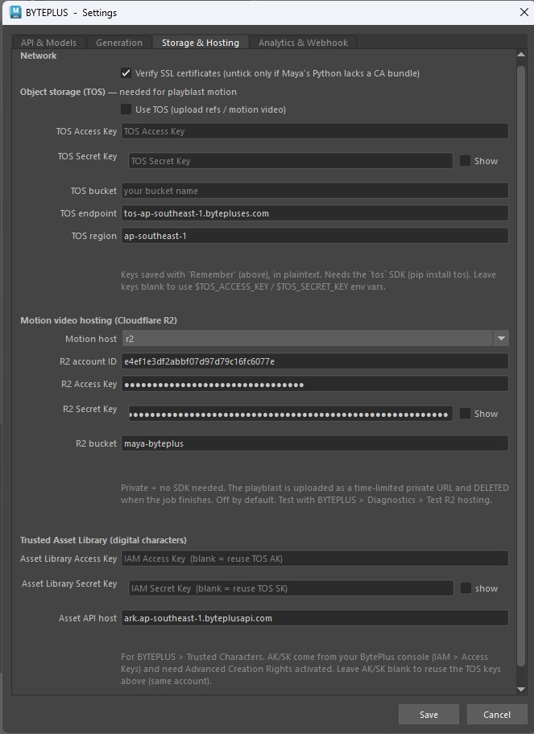

- **Analytics & Webhook** — the usage-data notice (features used, models and token
  counts; never prompts, scenes, images, videos or API keys), optional name /
  email / company, and **Developer mode** — *Show the Diagnostics menu (developers
  / partners)*.

> **Cost guard:** when an estimate exceeds your threshold (*Settings > Generation
> > Confirm above*), BYTEPLUS asks before spending. Cheap jobs (images) never prompt.

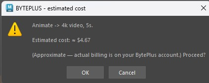

---

## 8. Tips & troubleshooting

- **Menu didn't appear?** Restart Maya once; if still missing, re-drag
  `install.py` and check the Script Editor for a `[BYTEPLUS]` error.
- **PC went to sleep (or Maya closed) while a video was generating?** You don't
  lose it. The clip renders on BytePlus's servers, not your machine — a brief
  network hiccup is ridden out automatically, and if the connection dies for good,
  the clip is **recovered automatically the next time you load the plugin** and
  saved into its own project folder. *Tip: for long 4K jobs, set Windows to never
  sleep — a screensaver or turning the display off is perfectly safe.*
- **Maya crashed during generation?** The installer disables Autodesk ADP (a
  known Windows crash) — make sure you **restarted Maya** after installing.
- **"model or endpoint does not exist" / HTTP 404?** Your key is reaching the
  server but that model isn't enabled for your account/region. Re-check the API
  key and model IDs in Settings; with Developer mode on, verify with
  **Diagnostics > Test Seedream (image)**.
- **Seed 3D fails with "NotFound" / 404?** Check that *Settings > API & Models >
  3D model (Seed 3D)* is `hyper3d-gen2-260112` (or your own `ep-…` endpoint) and
  that the model is enabled on your account.
- **"All variations failed" with Pro?** Pro runs a higher-quality mode and can
  take a few minutes per image — the plugin waits, but a very slow network can
  still time out. Try again, switch that window to **Lite**, or set output format
  to **JPEG** (Settings > API & Models).
- **Animate motion is only "approximate"?** Enable the playblast as a motion
  reference via **BYTEPLUS > Set up motion hosting…** (then tick *Use the scene's
  animation (playblast)*).
- **Video motion drifts / speeds up?** Match the **playblast length** to a
  whole-second output duration so Seedance doesn't time-warp it.
- **Asked for 1080p / 4K but got 720p?** Seedance 2.5 renders 480p / 720p only.
  Switch *Settings > API & Models > Seedance (video) model* to Seedance 2.0 (or pick
  **Base** in Video GEN) for 1080p / 4K.
- **A face is rejected when animating.** Make faces with **Text to Image** and
  animate them, or register the character in **Trusted Characters** (permanent).
  Viewport-guided faces need KYC HIGH; real human faces are never allowed.
- **A finished video was flagged for "copyright" / sensitive content?** That is
  Seedance's *output* filter, and your inputs were accepted. Retry, rephrase, or
  turn audio off.
- **Trusted Characters: "+ New" does nothing?** Add your **Access Key + Secret
  Key** in **Settings > Storage & Hosting > Trusted Asset Library** first, then
  close and reopen the window. The very first character also needs the one-time
  authorization letter signed in the console.
- **Trusted Characters is empty but my character exists?** The list shows the
  characters created on this machine. Use **🔍 Find…** to import one by name.
- **"A trusted character asset no longer exists"?** That trusted character (or
  image) was deleted from the Asset Library (Seedance reported *"The specified
  asset … is not found"*). The plugin forgets it and won't send it again; try again
  and the image's fresh link or local file is used instead — a face older than
  ~24 h needs **🎭 Make permanent** again — or pick another trusted character.
- **An image can't be added to Trusted Characters?** It must be JPEG / PNG / WEBP /
  BMP / TIFF / GIF / HEIC / HEIF, 300–6000 px on each side, aspect ratio 0.4–2.5
  and under 30 MB — and show an AI-generated (not real) person.
- **"credentials expired" / ExpiredToken?** Temporary STS keys (`AKTP…`) last
  ~12 h. Mint a fresh Access Key / Secret Key / Session token and paste all three in
  Settings > Storage & Hosting (TOS and/or Trusted Asset Library).
- **"Edit video" / uploading a local trusted image needs motion hosting.** Set up
  Cloudflare R2 / TOS in **Settings > Storage & Hosting**.
- **Dialogue audio was ignored in the video?** Set up motion hosting (clips are
  uploaded like the playblast) and stay within the model's limit (2.0: 3 clips /
  15 s; 2.5: 10 clips / 30 s).
- **"ffmpeg not found" on macOS (Extend / joining clips)?** Install ffmpeg (for
  example `brew install ffmpeg`), then restart Maya. Homebrew (Apple Silicon or
  Intel) and MacPorts locations are found automatically.
- **Image to Image mixed everything together?** Use **✨ Auto-compose**, keep to one
  composition image, and give every other image a distinct role.
- **Behind a corporate proxy / VPN?** Compressed (gzip) API responses and macOS
  keychain certificates are handled automatically. If every call still fails with
  an SSL error, see the next tip.
- **SSL certificate error?** Install `certifi` into Maya's Python, or untick
  *Settings > Storage & Hosting > Verify SSL certificates* (less secure).
- **Something failing?** Tick *Settings > Analytics & Webhook > Developer mode*; the
  **Diagnostics** submenu then has a test for each service (Seedream, LLM,
  Seedance, image refs, TOS, R2, Trusted Asset Library, telemetry). Results print
  to the Script Editor.
- **Check your usage.** BYTEPLUS > Usage… shows images, videos, 3D and tokens used
  on this machine.
- **Found a bug?** BYTEPLUS > Report a Bug…

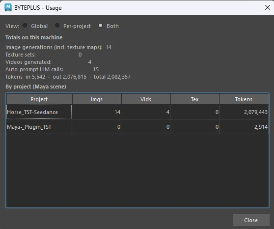

---

*BYTEPLUS for Maya — Technology Preview v2.02. Built on BytePlus ModelArk:
Seedream 5.0 (image), Seedance 2.0 / 2.5 (video), Seed Audio 1.0 (voice / music /
SFX), Seed 3D, and Seed 2.0 (LLM).*
